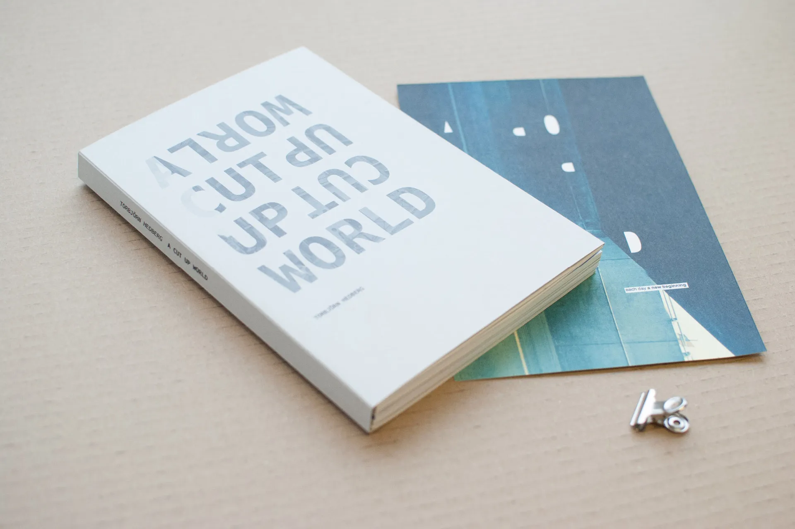
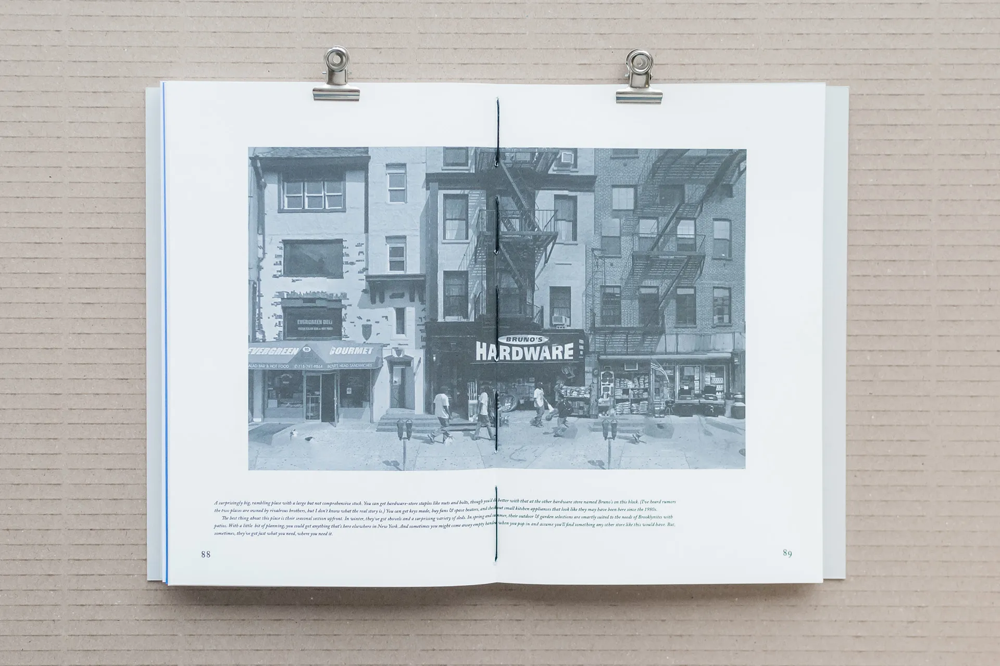
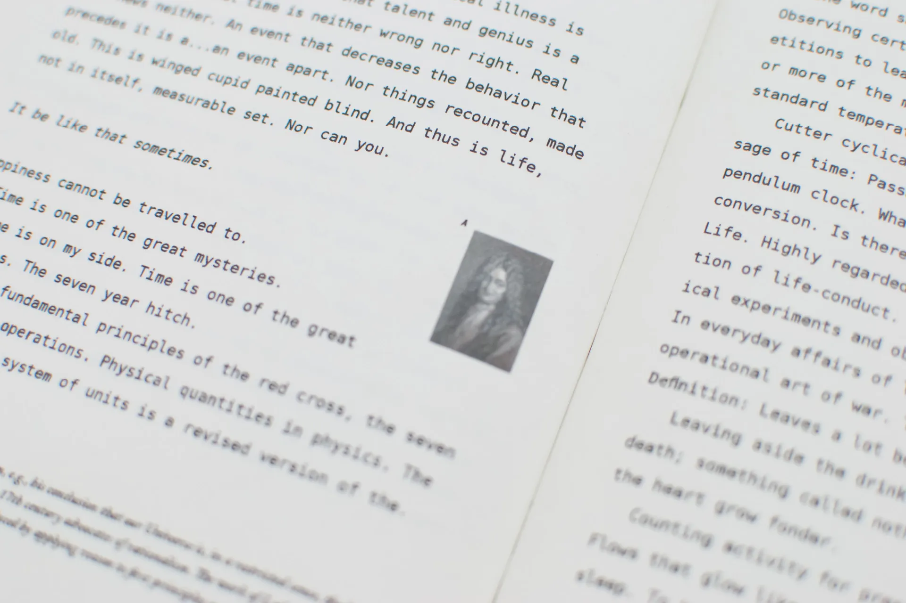
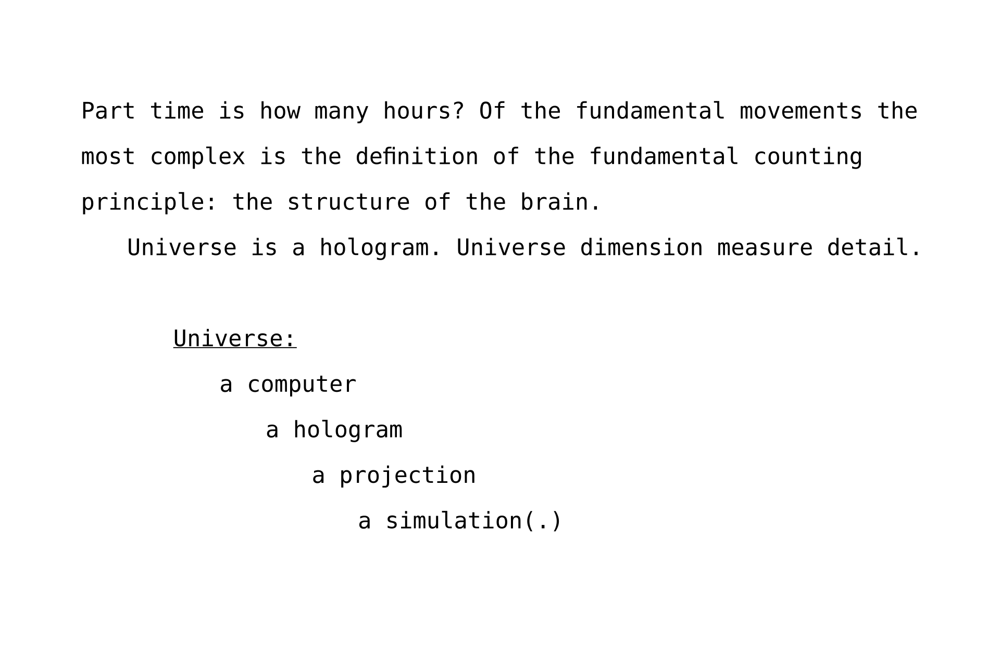
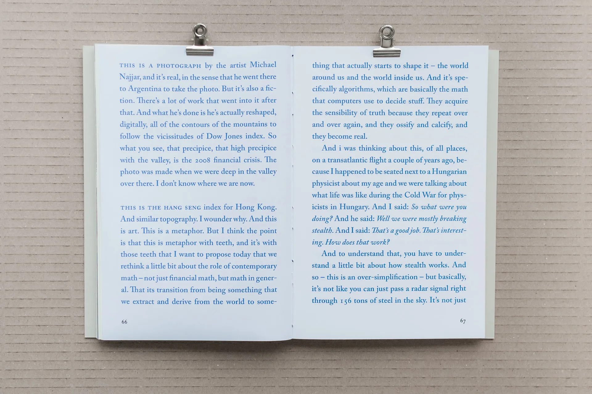
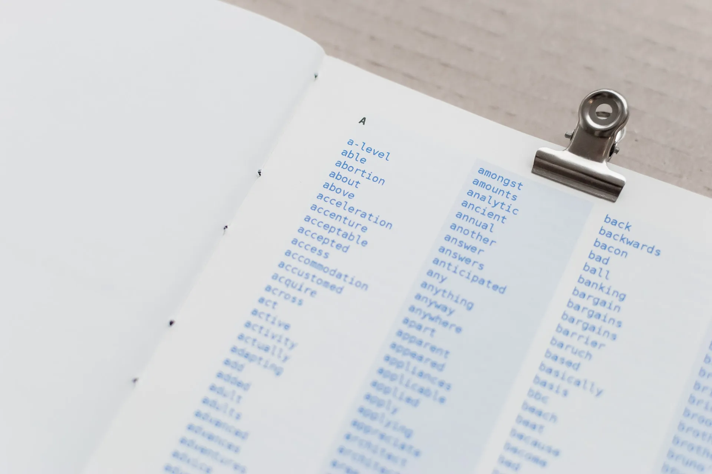

{.myclass}

### About
An exploration of our time and the borderland between two worlds. How they differ; but also how they draw near to one another. An investigation of how the internet and the tools we use daily can be used to create a story.

#### Role
Graphic designer

