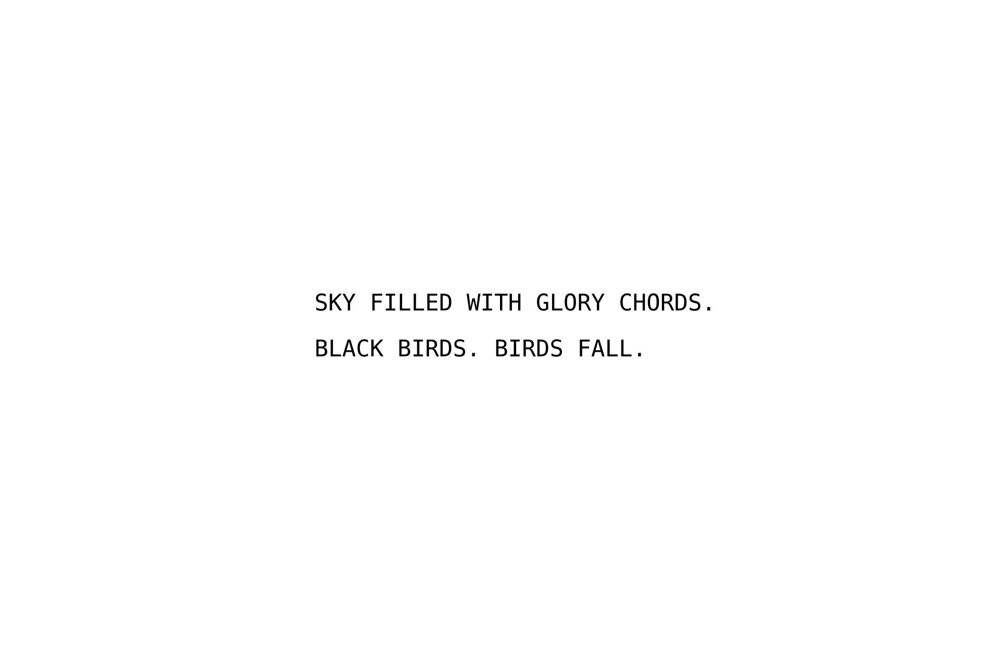

{.myclass}

### About

A Cut up World is a bachelor thesis project investigating how digital tools shape narrative and identity. Using Google's search suggestions as source material, the book applies cut-up technique to create fragmented stories that mirror our relationship with algorithmic systems.

The book design reflects this fragmented digital reality through collage, typography, and mixed media. Digital screenshots sit alongside analog textures, creating visual tension between screen and print. The layout embraces discontinuity—pages break apart, overlap, and recombine, making the reader actively piece together meaning rather than passively consume it.

This project represents an early exploration of how design can critically engage with technology rather than simply illustrate it—a thread that runs through my work from print to digital product design.
<!--more-->

