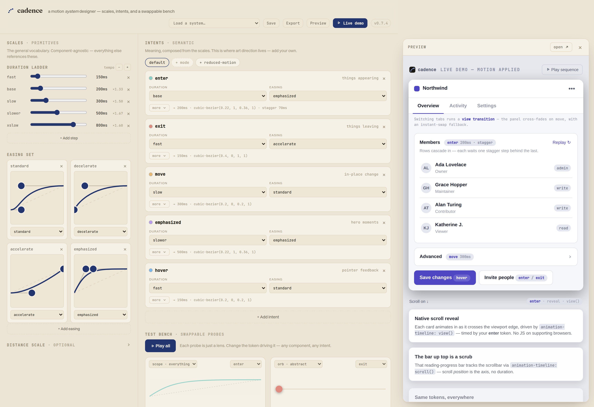
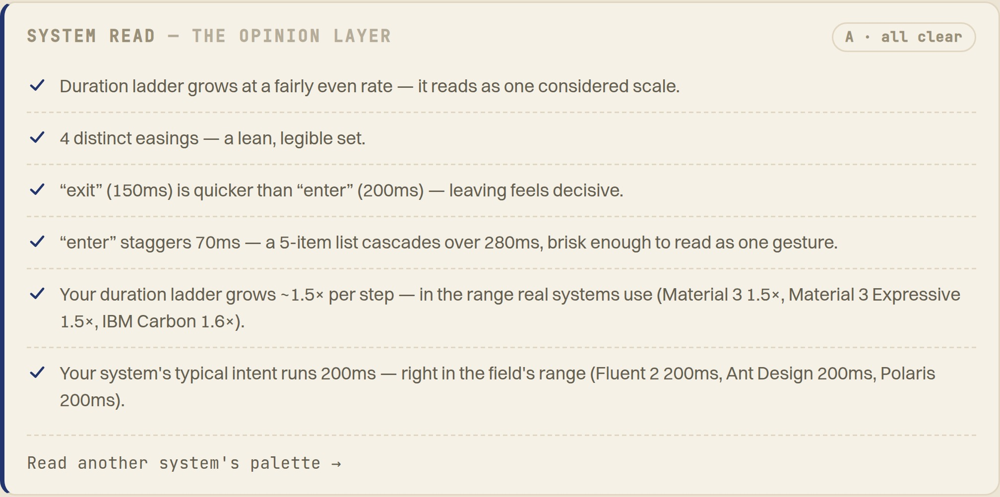



Motion is the last unsystematised corner of a design system. Colour has tokens; type has a scale. Motion is still magic numbers — a `cubic-bezier` tuned by feel, pasted from memory, never written down. **Cadence** treats it like the rest of the system, and gives it an opinion.

Two layers, borrowed from how we already handle colour. *Primitives* are the raw vocabulary: a duration ladder and a set of easings you draw by hand. *Intents* are the meaning — `enter`, `exit`, `move` — composed from the primitives by reference. You name what motion is *for*, not what it *is*; change a primitive and the whole system re-times.

The decision I'm happiest with was to stop designing around components. An early version pinned four roles to four demo components and fell apart the moment I imagined a fifth. So components became a bench of instruments — each a lens on a single quality of a token, never a screen to restage. Organise a system around its own tokens and nothing can fall outside it.

Most tools generate; they don't judge. The part I'm proudest of is the one with a point of view: it reads the whole set and says where it's off — an easing that's secretly two, an exit slower than its entrance, a ladder that limps — and *what it would change*, not only what's wrong. Encoding that judgement — an art director's eye as a handful of checks — is the whole idea.

None of it stays in the tool. Cadence exports the CSS you'd have written by hand, and drives a real product surface so you can feel the system rather than just read it.

The real test was turning it on myself.

I pasted this site's own motion tokens in. It liked the rhythm — and caught me being lazy: two of my easings are, quietly, the same curve. A tool worth shipping should be able to embarrass its maker. This one did.

**Live:** [cadence.tor2dbear.com](https://cadence.tor2dbear.com) · **Source:** [github.com/tor2dbear/cadence](https://github.com/tor2dbear/cadence)
