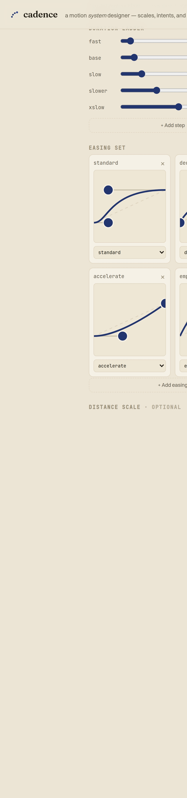
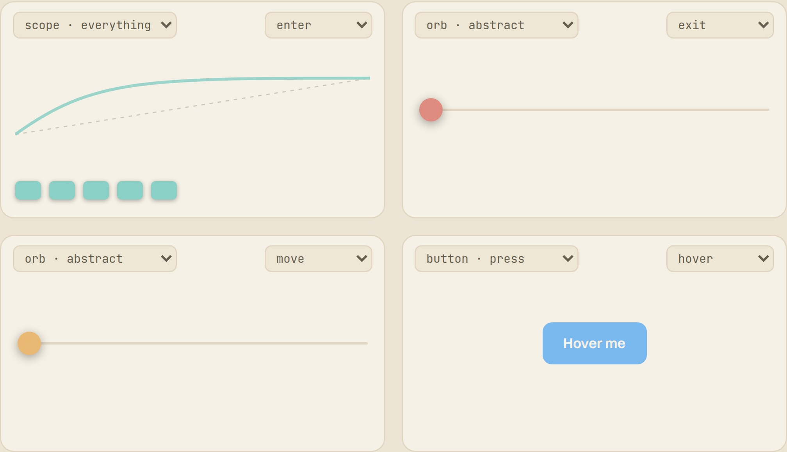
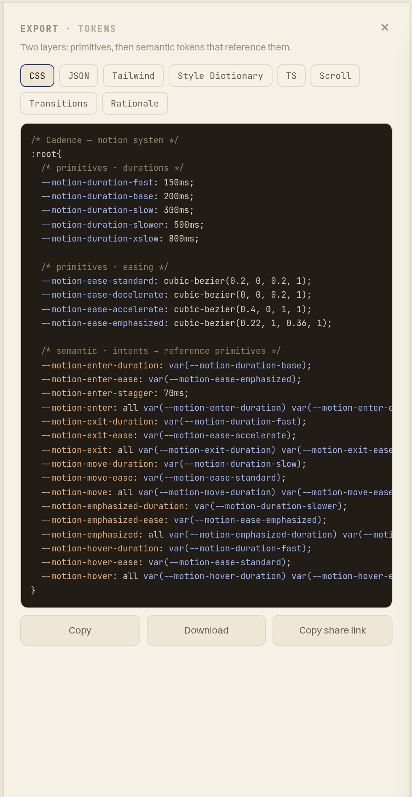



Color and type are solved problems in a design system — tokenised, documented, reused. Motion isn't. It's still copy-pasted magic numbers: a `cubic-bezier` here, a `300ms` there, tuned by feel and never written down. **Cadence** is my answer to that gap — a tool that treats motion the way a design system treats everything else, and then has an opinion about the result.

### Math gets you 80%

Most motion tooling hands you one curve at a time. cubic-bezier.com, easings.net — a single easing, in isolation. They're calculators, not systems. And the maths is the easy part: any generator produces a plausible curve. The last 20% — the part that makes motion feel *considered* rather than random — is art direction: how the whole set relates, which durations pair with which easings, whether entering and leaving feel deliberately different. No tool made that legible or reusable, so motion stays tribal knowledge — re-derived per component, drifting over time.

### Two layers of tokens

Cadence borrows the structure a design system already uses for colour — **primitives → semantic tokens** — and applies it to motion.

**Primitives** are the vocabulary: a duration ladder and an easing set, component-agnostic. Each easing is authored directly by dragging its control points, with headroom for overshoot; an easing can even be a spring, sampled to CSS `linear()` so real physics animates natively.

**Intents** are semantic tokens — `enter`, `exit`, `move`, `emphasized` — composed *by reference* from the primitives (`enter = duration.base + emphasized`). This is where art direction lives: you name *meaning*, not numbers, and the numbers stay in one place.

The hardest decision was what to do with components. An early version hard-wired four roles to four demo components — and broke the moment you imagined a fifth. So I demoted components to a **swappable bench of abstract instruments**: each probe is a *lens* pointed at one intent, isolating a single measurable quality — the curve, the stagger, the travel — rather than re-staging a UI. Organise around the token architecture and nothing can fall outside it.

### The opinion layer

Generators generate; they don't judge. The part I care about most is the **system read** — an opinion layer that critiques the whole system rather than one curve. Is the ladder evenly spaced? Are two easings secretly the same? Does *exit* leave faster than *enter* arrives? Is the duration budget past the ~550 ms "now I'm waiting" line?

Findings are ranked worst-first, each carries a one-line fix — most with a one-click **Apply** — and a comparative read benchmarks the system against real ones (Material, Carbon, Fluent…) so the numbers get a reference frame. Encoding an art director's eye as checks is the whole thesis: a tool that tells you what to *do*, not only what's wrong.

### From system to shipped code

A motion system only matters if it ships. Cadence exports the token set as CSS custom properties — semantic intents `var()`-referencing the primitives, exactly as you'd write them by hand — plus JSON, a Tailwind config, a Style Dictionary file, and a typed TS object, each copying or downloading under its conventional filename.

And it isn't just curves in a panel: a live demo surface drives real components with the system and re-times as you edit.

### I ran it on my own site

The strongest test was turning it on myself. I pasted **this portfolio's** motion tokens into Cadence's palette reader and ran the same critique over them.

It scored them **B — 88/100**, confirmed the duration ladder grows at a sane ~1.3× per step (right in the range Spectrum, Polaris and Fluent use) — and caught something I'd missed: two of my easings, `accelerate` and `exit`, are very nearly the same curve. A leaner set is easier to apply consistently; the fix was to drop one. That's the whole point of the exercise — the opinion layer does real work on real tokens, including my own.

**Live:** [cadence.tor2dbear.com](https://cadence.tor2dbear.com) · **Source:** [github.com/tor2dbear/cadence](https://github.com/tor2dbear/cadence)
