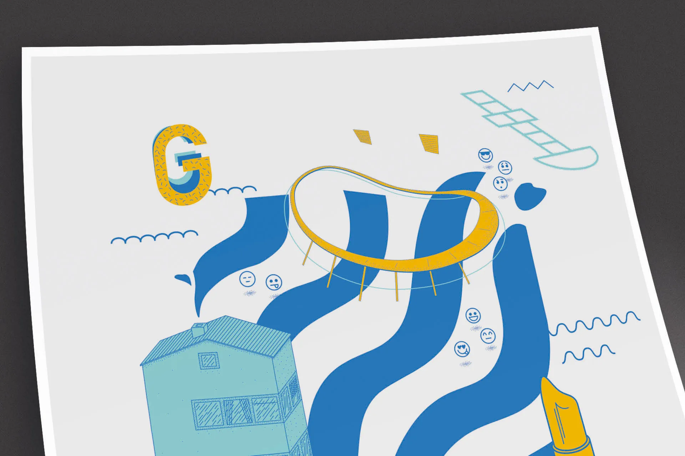

### About

A self-initiated poster project depicting the landmarks and symbols of Gothenburg. Combining illustration with graphic design to celebrate the character of the city through its architecture, waterways and cultural references.

