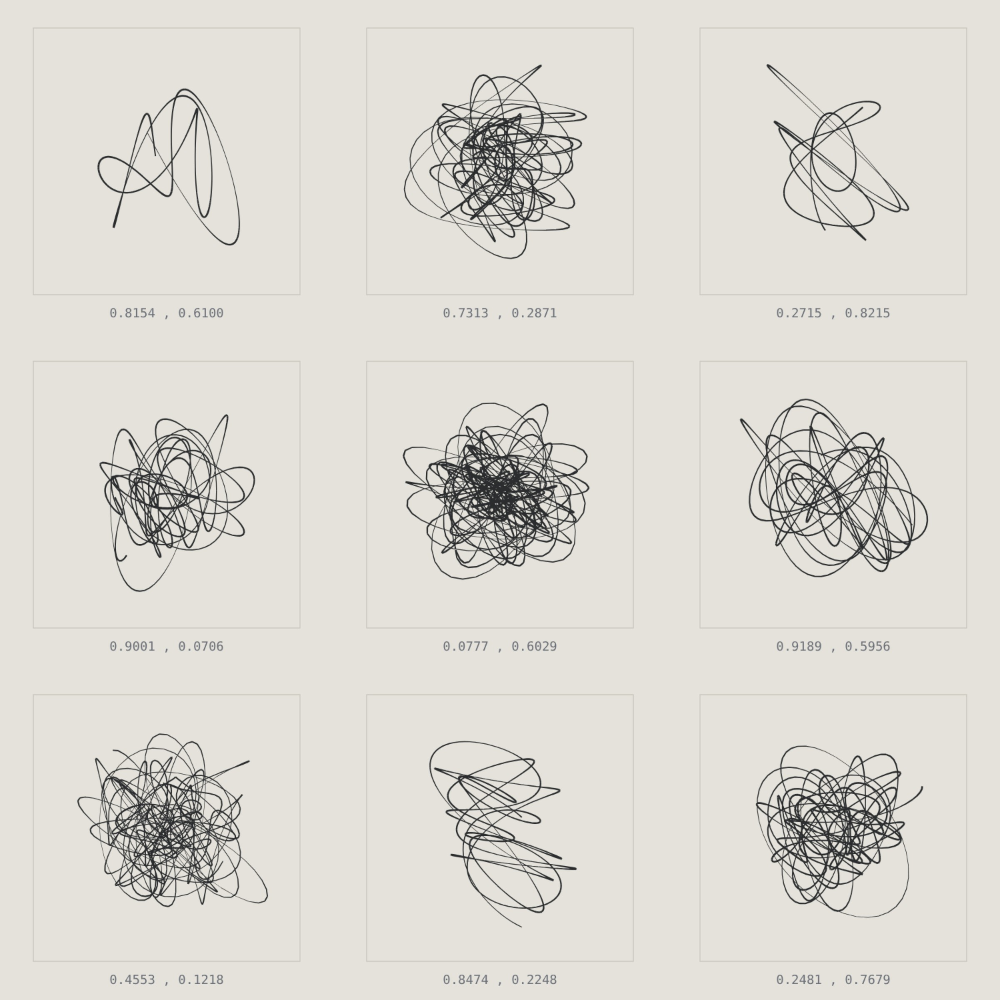
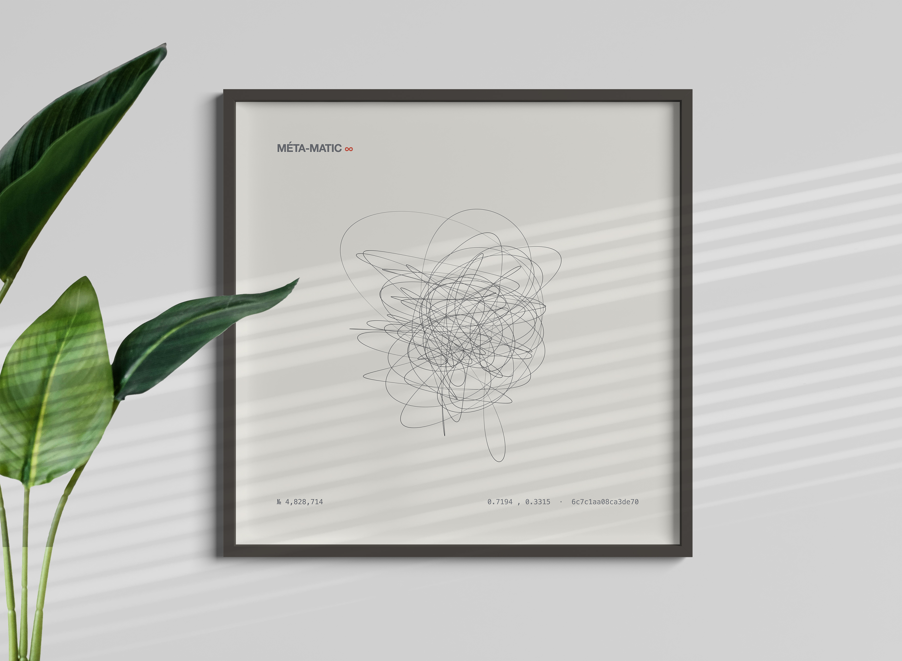



In 1959 **Jean Tinguely** built machines that drew abstract art on a conveyor belt — the _Méta-Matics_, a joke about the spontaneous genius. Méta-Matic ∞ is the same joke, moved to the AI era. This machine draws too. But it doesn't _randomise_ its works; it _retrieves_ them from a continuous space where every possible drawing is already a point. To move forward is to interpolate. The question is no longer Tinguely's "what is art when a machine can make it?" but: **infinitely many, never anything new — where is the original?**

Each work is drawn with stacked epicycles whose parameters are fetched from a continuous noise field — neighbouring coordinates give near-identical drawings, so the belt glides rather than jumps. And it runs on the wall clock, not the visitor: the serial number is a function of time, so it's the same work for everyone right now, with no server. You can look away, but you can't stop the machine — the counter keeps ticking, and when you look back it has drawn without you. "Works produced" climbs. **The originals stay zero.**

The only thing you can do is make a work yours: inspect it enlarged and **certify** it. Each work can be certified exactly once — first come, a single owner. A certificate of authenticity for something infinitely copyable. That _is_ the joke.

And the irony outlives the exclusivity: what you own is the only copy, entirely genuine — yet its neighbour, a near-duplicate that keeps recurring, can't be told apart from it. An original that is nonetheless visually banal.

You can certify straight in the browser, or with a wallet signature — free, no gas, a verifiable and optional nod to NFTs, never a gate. A counter shows how many have been certified in total, and _The Space_, the coordinate map, plots everyone's certified points alongside yours: no edges, everything recurs; one path, everyone walks it. If two try to certify the same work at once, one wins; the other learns it was taken 40 ms earlier — and that infinitely many others remain.

And in the end the machine does what Tinguely's did first: it leaves the screen and becomes paper. A work can be ordered as a physical print, straight from the page — the digital critique of the original lands in something you can hold. And still: what hangs on the wall is no more unique than the coordinate it came from; your neighbour can print the near-duplicate beside it.

An honest footnote, because it belongs to the work: the "latent space" is mathematically simulated, not a real model. It doesn't matter to the point — and saying so out loud is part of it.

**Live:** [meta-matic.tor2dbear.com](https://meta-matic.tor2dbear.com) · **Source:** [github.com/tor2dbear/meta-matic](https://github.com/tor2dbear/meta-matic)
