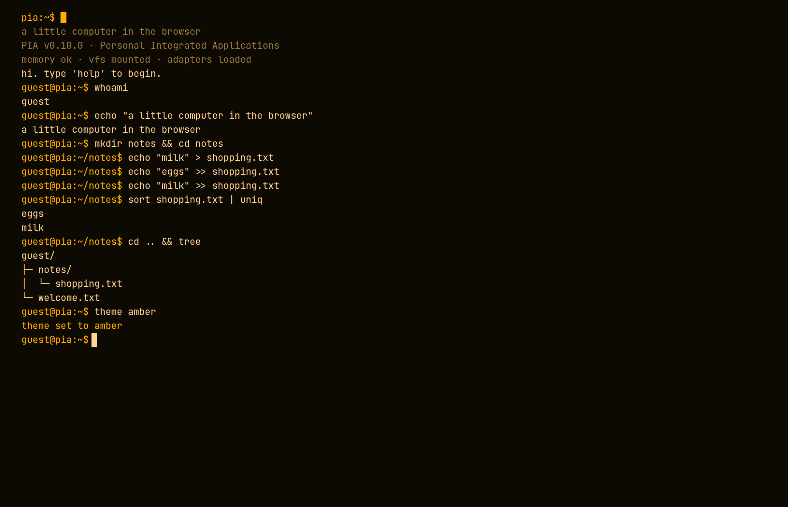

### Overview

PIA is a working little computer that lives entirely in the browser. You log in at a prompt, navigate a filesystem, edit files, and run commands with pipes (`sort fruit.txt | uniq`) — no backend required to get started. Sign in and everything syncs to the cloud; otherwise it all runs locally.

The name nods to Apple's *Lisa* — PIA stands for *Personal Integrated Applications*.

**It's as much a design study in consistency as a product.** One rule — *terminal idiom first* — drives every decision, all the way down into the architecture. This case study is about what that single constraint bought, and what it cost. It's also the clearest argument I can make for how I approach products: pick one principle, push it into the architecture, and let structure — not willpower — hold the thing together as it grows.

### The idea

I wanted to see how far you can take "a computer in a tab" if you refuse to cheat — not a toy terminal with a few made-up commands, but something that behaves like a real shell: the same names, flags and flows as a Unix environment, that happens to live in the browser and works with a thumb on a phone.

**The tension is that two worlds collide.** The terminal is keyboard, text, and conventions from the 1970s. The web is touch, share links, email sign-in and home-screen apps. The whole design job is letting one lead without betraying the other.

### The design principle: terminal idiom first

Every command follows Unix convention — **name, flags and behaviour.** Prefer the real terminal name (`nano`, `useradd`, `grep -n`) over a friendly web invention (`edit`, `register`, a GUI shortcut). Friendly names stay as *aliases*, never as the primary.

It sounds strict, and that's the point. **Consistency is a feature:** know one thing and you can guess the next. The editor is `nano` (`^O` saves, `^X` exits). Account creation is `useradd`. The prompt is `user@pia:~$`. Settings live in a `.pia/` dotfile. It's the same muscle memory as a real shell.


**The hardest decision was what to do when there *is* no terminal equivalent.** Email, password and a confirmation mail are pure web. `share`/`publish` returning a URL has no shell counterpart. Touch buttons likewise. Rather than dress them up as something they aren't, the rule is blunt — and it's the line between a product with an opinion and a pile of features.

> Flag the deviation and make it a deliberate, documented decision — not a slip.

### Architecture as a design decision

**The most designed part of PIA isn't on screen: the adapters are the seam.** The terminal never touches storage or auth directly — only the `StorageAdapter` / `AuthAdapter` / `ShareStore` interfaces. Every command reaches the world through one small, defined `CommandContext` (print, filesystem, auth, stdin …), never via the DOM.

**That turns a big product change into a swap, not a rewrite.** Guests run local adapters; signed-in users run cloud adapters (Supabase) — behind the exact same interface. Full-screen apps (the editor, the games) are "just another screen app" taking over through the same mechanism, so new tools cost almost nothing to add.

For a designer, this is the core: **structure is what lets a product grow without decaying.** The seam is invisible, but it's the reason everything else feels light.

, behind the same contract.")

### Selected design decisions

**Themes are five tokens, not a re-skin.** Four CRT-inspired palettes (green phosphor, amber, ice, greyscale) each set only five colour tokens — the rest of the interface follows automatically. The two frames below are the *same session* in two of those palettes: nothing is restyled per theme, the tokens simply cascade. The typeface is JetBrains Mono, self-hosted so it renders for everyone within a strict security policy (CSP), and shared with this portfolio for a cohesive feel.




**The editor is really `nano`.** Full-screen apps take over through the same mechanism as everything else and inherit the theme for free, so the editor keeps the idiom intact: `^O` saves, `^X` exits, line and column in the status bar.


**The touch bar is context-aware — a web deviation, made on purpose.** On a physical keyboard it hides completely (Tab, arrows and pipe are already on the keys). On touch it appears, grouped into logical clusters with hairline dividers: *completion · navigation · punctuation · control*. The control group is a single `ctrl` button that unfolds the whole readline set (`^A ^E ^U ^K ^W …`), so the bar stays clean as the functionality grows.


**Same app, different home.** Installed on the iOS home screen there's no browser chrome to lean on. `display-mode: standalone` plus real safe-area handling (camera notch, home indicator) makes everything sit edge to edge — while the browser mode is left untouched. And **push is real:** reminders (`remind`) and collaboration notices reach the phone via Web Push even when the tab is closed — the same terminal command, a cloud function underneath.

### Challenges and trade-offs

**When the idiom runs out.** Inviting someone to a shared checklist (`todo share <name> <email>`) has no clean Unix equivalent — the closest relative is `chmod`/`chown`. It became a deliberate, documented web deviation rather than a forced metaphor. Same with file upload reaching the OS picker: named straight out, not disguised as `scp`.

**The QR code that wouldn't scan.** My first hand-coded QR generator produced codes that looked right but wouldn't read. Rather than chase the bug forever, I swapped to a proven library and verified with a real scanner in the test — the right call over pride.

**Python in the browser.** Python runs via Pyodide (WASM) in an isolated, self-hosted sandbox — no external CDN, everything inside the same security policy as the rest.

### Quality: the test that reads like a tour

The most unusual decision is how PIA is verified. **The whole product is exercised through one scripted session** in the real terminal, saved as a readable transcript ("the tour"). Add a feature, and you add lines to that session and review the diff against the saved transcript — that diff *is* the verification. The clock is frozen and volatile output masked, so the only thing that moves is real behaviour. The result is a regression test that also reads as a guided tour of the product.

```diff
 guest@pia:~$ at now+5m echo remember
 scheduled for Sat Jul 18 12:05 UTC 2026
   echo remember
+guest@pia:~$ remind now+1h standup
+remind: reminders need a cloud account — run `login`
```

*A real slice of the tour: adding `remind` appended the two green lines — and its honest guest declination is the behaviour under test. The frozen clock keeps the diff stable; the reviewed diff is the verification.*

On top of it: type checking, unit tests, and manual checks in a real browser for what tests can't see (colours, WASM, PWA behaviour). Everything lands via branch → PR → CI → merge, with automatic preview URLs per change.

### What it proves

PIA set out to test one claim: **that a single, uncompromising principle — carried all the way into the architecture — produces a product that feels whole and stays cheap to extend.** Two pieces of evidence hold it up. First, the adapter seam made the biggest change (guest → cloud) a swap rather than a rewrite, and made each new game or tool nearly free — the structure paid for itself. Second, the scripted "tour" means every documented behaviour is also a test, so consistency isn't a hope, it's enforced on every merge.

**The honest cost:** idiom-first is a constant tax on the web-native parts — every deviation (`share`, uploads, the touch bar, push) had to be argued and written down instead of just shipped. That discipline is exactly what gives the product its point of view, but it makes it slower to add anything that doesn't fit the metaphor.

Today PIA is a deployed, installable PWA with a broad command register, an editor, real-time shared checklists, a package system with games and tools, Python support, themes, and push notifications — running as well under a thumb as on a desktop. **The best way to judge it is to press some keys yourself.**

### Next steps

- A guided `demo` that shows off the highlights for a first-time visitor.
- More readline shortcuts (e.g. `^R` reverse search) — now trivial thanks to the Ctrl tray.
- An accessibility / Lighthouse pass and better theme discoverability.
- Extracting the core engine into a standalone npm package.

### Role

Concept, design, architecture and development — solo. From the first prompt to a deployed PWA.
