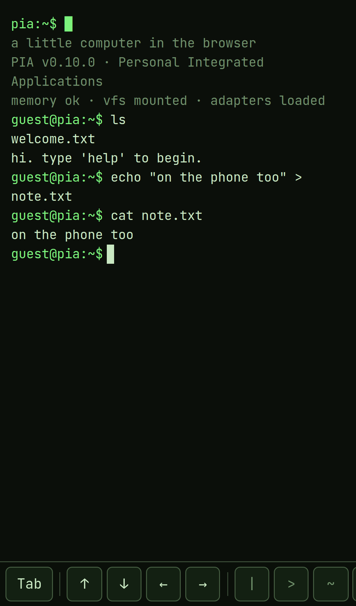

### Overview

PIA is a working little computer that lives entirely in the browser. You log in at a prompt, navigate a filesystem, write in an editor, run commands with pipes (`sort fruit.txt | uniq`), install small packages with `brew`, play games and even run Python — without ever leaving the tab. No backend is required to get started; log in and everything syncs to the cloud, otherwise it all runs locally.

The name is a nod to Apple's *Lisa* — PIA stands for *Personal Integrated Applications*.

The project is as much a **design study in consistency** as it is a product: a single, clear rule — *terminal idiom first* — that gets to drive every decision, all the way down into the architecture.

### The idea

I wanted to see how far you can take the metaphor of "a computer in a tab" if you refuse to cheat. Not a toy terminal with a couple of made-up commands, but something that actually behaves like a shell: the same names, the same flags, the same flows as a real Unix environment — but that happens to live in the browser and works just as well with a thumb on a phone.

The challenge is that two worlds collide. The terminal is keyboard, text and conventions from the 1970s. The web is touch, share links, email sign-in and home-screen apps. The whole design effort is about letting one drive without betraying the other.

### The design principle: terminal idiom first

Every command and flow should follow Unix convention — **name**, **flags** and **behaviour**. Prefer the real terminal name (`nano`, `useradd`, `grep -n`) over a friendly web invention (`edit`, `register`, GUI shortcuts). Friendly names may stay as **aliases**, never as the primary.

It sounds strict, and that's the whole point. Consistency is a design feature: if you know one thing you can guess the next. The editor is `nano`, saves with `^O`, exits with `^X`. Account creation is `useradd` (alias `register`). The prompt is `user@pia:~$`. Settings live in a `.pia/` dotfile. None of this is random — it's the same muscle memory as a real shell.

**The most important decision was what to do when there *is* no terminal equivalent.** Email + password + confirmation mail is pure web. `share`/`publish` that returns a URL has no shell counterpart. Touch buttons on mobile likewise. Instead of pretending they are something they're not, the rule is: **flag the deviation and make it a deliberate decision, not a slip.** Every such web deviation is documented and justified. That's the difference between a product with an opinion and one with a pile of features.

### Architecture as a design decision

The most designed part of PIA isn't on the screen: **the adapters are the seam.** The terminal never touches storage or auth directly — only the `StorageAdapter` / `AuthAdapter` / `ShareStore` interfaces. Every command reaches the world through a small, defined `CommandContext` (print, filesystem, auth, stdin …), never via the DOM or storage.

That makes a big product change a **swap, not a rewrite**: guests run local adapters, signed-in users run cloud adapters (Supabase) — behind the exact same interface. Full-screen apps (the editor, the games) are "just another screen app" that takes over via the same mechanism. New games and tools cost almost nothing to add.

For a designer this is the core: **structure is what lets a product grow without decaying.** The seam is invisible, but it's the reason everything else feels light.

### Selected design decisions

**Themes and typography.** Four CRT-inspired palettes (green phosphor, amber, ice, greyscale) that only set five colour tokens — the rest of the interface follows automatically. The typeface is JetBrains Mono, self-hosted so it renders for everyone within a strict security policy (CSP), and the same typeface as my portfolio for a cohesive feel.

**The editor is really `nano`.** Full-screen apps take over via the same mechanism as everything else, inherit the theme for free and keep the same idiom: `^O` saves, `^X` exits, line and column in the status bar.

**The command bar (touch bar) is context-aware.** On a device with a physical keyboard it hides completely — Tab, arrows and pipe are already on the keys. On touch it appears and is grouped into logical clusters with hairline dividers: *completion · navigation · punctuation · control*. The colours follow the theme. The control group is a single `ctrl` button that unfolds the whole readline set (`^A ^E ^U ^K ^W …`) — so the bar stays clean even as the functionality grows.

**PWA vs browser — same app, different home.** Installed on the iOS home screen there's no browser chrome to lean on. Through `display-mode: standalone` and proper handling of the "safe area" (camera notch, home indicator), everything sits edge to edge without ugly gaps — but the browser mode is left untouched. Details like removing an empty margin below the button row when the keyboard folds up are invisible until they're missing.

**Real push notifications.** Reminders (`remind`) and collaboration notices reach the phone via Web Push even when the tab is closed — the same terminal command, a cloud function under the hood.

### Challenges and trade-offs

**When the idiom isn't enough.** Inviting someone to a shared checklist (`todo share <name> <email>`) has no clean Unix equivalent — the closest relative is `chmod`/`chown`. It became a deliberate, documented web deviation rather than a forced metaphor. Same with file upload reaching the OS file picker: named straight out, not disguised as `scp`.

**The QR code that wouldn't scan.** My first hand-coded QR generator produced codes that looked right but wouldn't read. Instead of chasing the bug forever, I switched to a proven library and verified with a scanner in the test — the right call over pride.

**Python in the browser.** Python runs via Pyodide (WASM) in an isolated, self-hosted sandbox — no external CDN, everything within the same security policy as the rest.

### Quality: a session as documentation

Perhaps the most unusual part: **the whole product is tested through a single scripted session** through the real terminal, saved as a readable transcript ("the tour"). When I add a feature I add lines to that session and review the diff against the saved transcript — that diff *is* the verification. The clock is frozen and volatile output is masked, so the only thing that changes is real behaviour. The result is a test that also reads as a guided tour of what PIA does.

On top of that: type checking, unit tests and verification in a real browser for what the tests can't see (colours, WASM, PWA behaviour). Everything lands via branch → PR → CI → merge, with automatic preview URLs per change.

### Where we stand

PIA is a working, deployed product with a broad command register, a text editor, shareable checklists with real-time collaboration, a package system with games and tools, Python support, themes, and an installable PWA with push notifications. It runs just as well on desktop as with a thumb on a phone.

Above all it's proof of a thesis: that a **single, uncompromising design principle** — consistent all the way down into the architecture — yields a product that feels whole, is easy to build on, and has a clear personality.

### Next steps

- A guided `demo` that shows off the highlights for a first-time visitor.
- More readline shortcuts (e.g. `^R` reverse search) — now trivial thanks to the Ctrl tray.
- Accessibility/Lighthouse pass and theme discoverability.
- Extracting the core engine into a standalone npm package.

### Role

Concept, design, architecture and development — solo. An own product and technical design study, from the first prompt to a deployed PWA.
