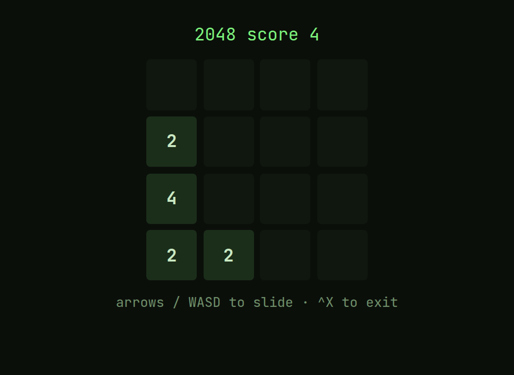
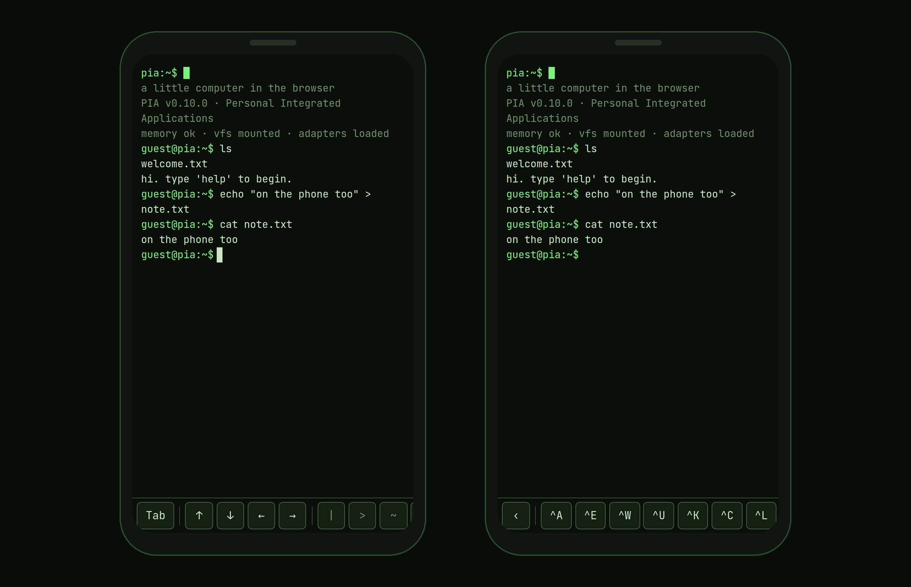

### Overview

PIA is a working little computer that lives in a browser tab. You log in at a prompt, move through a filesystem, edit files, and pipe commands (`sort fruit.txt | uniq`). No backend to get started: guests run locally, signed-in users sync to the cloud. The name nods to Apple's _Lisa_ — PIA is _Personal Integrated Applications_.

I wanted to see how far "a computer in a tab" goes if you refuse to cheat — not a toy terminal, but something that behaves like a real shell: the same names, flags and flows as Unix, that happens to run in the browser and works with a thumb on a phone.

That means two worlds collide. The terminal is keyboard, text and 1970s convention; the web is touch, share links, email sign-in and home-screen apps. **The whole project is one rule — _terminal idiom first_ — pushed all the way into the architecture.** It's the clearest argument I can make for how I build products: pick one principle and let structure, not willpower, hold things together as they grow.


_A looping, self-running tour — the built-in `demo` command replays a scripted session (deterministic, identical every take — not a screen recording)._

### The design principle: terminal idiom first

Every command follows Unix convention — **name, flags and behaviour.** The real name (`nano`, `useradd`, `grep -n`) wins over a friendly web invention (`edit`, `register`, a GUI shortcut); friendly names survive only as _aliases_. Know one command and you can guess the next: the editor is `nano` (`^O` saves, `^X` exits), the prompt is `user@pia:~$`, settings live in a `.pia/` dotfile.


The hard part is what to do when there's no terminal equivalent. Email and confirmation mails are pure web; `share` returning a URL has no shell counterpart; touch buttons likewise. Instead of dressing them up as something they aren't, the rule is blunt:

> Flag the deviation and make it a deliberate, documented decision — not a slip.

### Architecture as a design decision

**The most designed part isn't on screen: the adapters are the seam.** The terminal never touches storage or auth directly — only the `StorageAdapter` / `AuthAdapter` / `ShareStore` interfaces, reached through one small `CommandContext` (print, filesystem, auth, stdin …), never the DOM.

**So a big change is a swap, not a rewrite.** Guests run local adapters; signed-in users run cloud adapters (Supabase) behind the same interface. Full-screen apps — the editor, the games — take over through the same mechanism, so new tools cost almost nothing. Structure is what lets a product grow without decaying.


┌────────────────────────────────────────────────┐
│ Terminal · commands, pipes │
└────────────────────────┬───────────────────────┘
│ never touches storage, auth
│ or the DOM directly
┌────────────────────────▼───────────────────────┐
│ CommandContext │
│ print · filesystem · auth · stdin … │
└────────────────────────┬───────────────────────┘
│ the seam — only ever
│ sees interfaces
┌────────────────────────▼───────────────────────┐
│ StorageAdapter · AuthAdapter · ShareStore │
└────────────┬────────────────────────┬──────────┘
│ │
┌───────────▼──────────┐ ┌───────────▼──────────┐
│ Local runtime │ │ Cloud │
│ browser · guest │ │ Supabase · signed in │
└──────────────────────┘ └──────────────────────┘

one interface, two implementations —
a big change is a swap, not a rewrite.


### Selected design decisions

**Themes are five tokens, not a re-skin.** Four CRT palettes (green phosphor, amber, ice, mono) each set only five colour tokens; the rest follows. In the clip below, `theme amber` and `theme ice` recolour the whole screen at once — nothing is restyled per theme, the tokens simply cascade. The typeface is self-hosted JetBrains Mono, shared with this portfolio.


_A looping recreation of the saved `tour` session — real commands and output, animated (not a screen recording)._

**The editor is really `nano`.** Full-screen apps inherit the theme for free and keep the idiom: `^O` saves, `^X` exits, line and column in the status bar.




**The touch bar is context-aware — a web deviation, on purpose.** With a physical keyboard it's hidden; Tab, arrows and pipe are already there. On touch it appears in clusters — _completion · navigation · punctuation · control_ — and the control group is one `ctrl` button that unfolds the full readline set (`^A ^E ^U ^K ^W …`), so the bar stays clean as it grows.



**Same app, different home.** On the iOS home screen there's no browser chrome, so `display-mode: standalone` and real safe-area handling put everything edge to edge — while the browser stays untouched. Push is real too: `remind` and collaboration notices reach the phone via Web Push with the tab closed.

### Quality: the test that reads like a tour

**The whole product is verified through one scripted session** in the real terminal, saved as a transcript ("the tour"). Add a feature, add lines, review the diff against the saved copy — that diff _is_ the test. The clock is frozen and volatile output masked, so only real behaviour moves.

```diff
 guest@pia:~$ at now+5m echo remember
 scheduled for Sat Jul 18 12:05 UTC 2026
   echo remember
+guest@pia:~$ remind now+1h standup
+remind: reminders need a cloud account — run `login`
```

_A real slice of the tour: adding `remind` appended the two green lines, and its honest guest declination is the behaviour under test. The reviewed diff is the verification._

Under that: type checking, unit tests, and browser checks for what tests can't see (colours, WASM, PWA). Everything ships via branch → PR → CI → merge, with a preview URL per change.

### What it proves

**One uncompromising principle, carried into the architecture, made the product feel whole and cheap to extend.** The adapter seam turned the biggest change — guest to cloud — into a swap, and made each new game or tool nearly free. The scripted tour makes every documented behaviour a test, so consistency is enforced on every merge, not hoped for.

**The cost is real:** idiom-first taxes the web-native parts — every deviation (`share`, uploads, the touch bar, push) had to be argued and written down. That discipline is what gives PIA a point of view; it also makes anything that doesn't fit the metaphor slower to add.

Today it's a deployed, installable PWA — command register, editor, real-time shared checklists, a package system with games and tools, Python, themes, push. **The best way to judge it is to press some keys yourself.**
