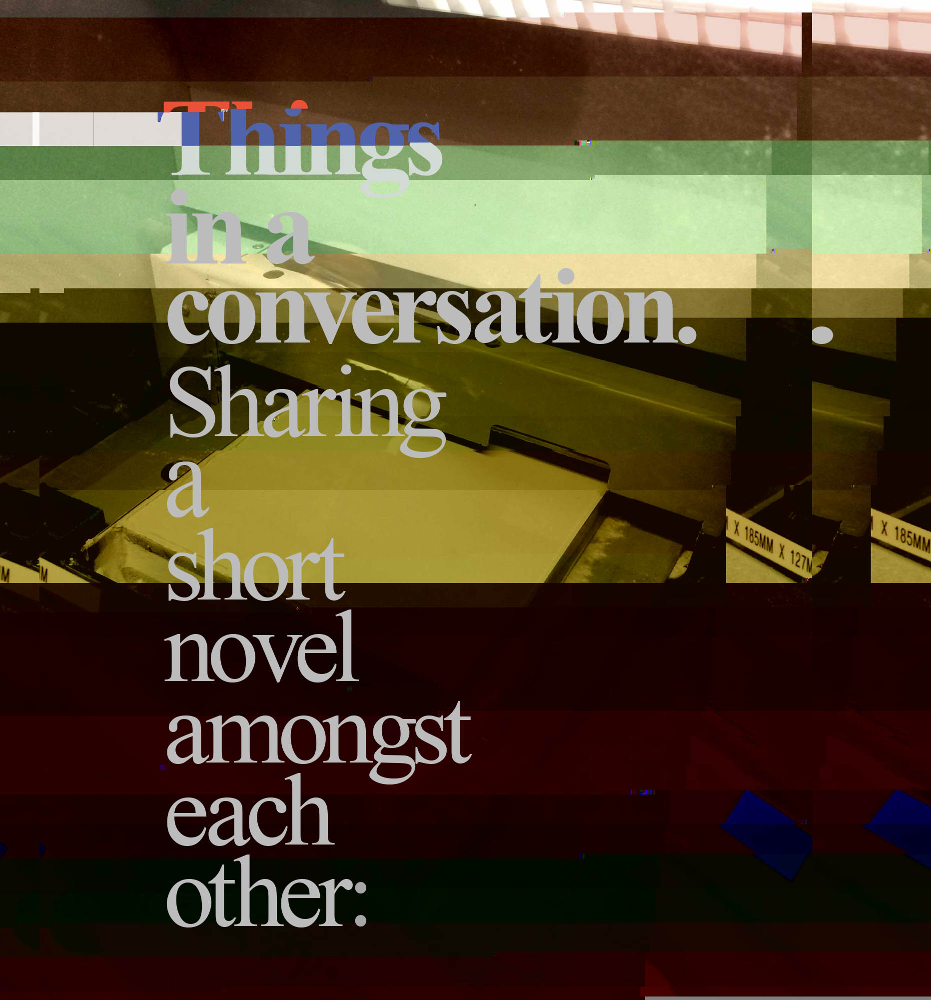
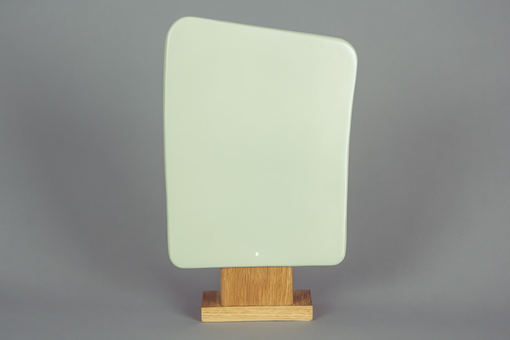
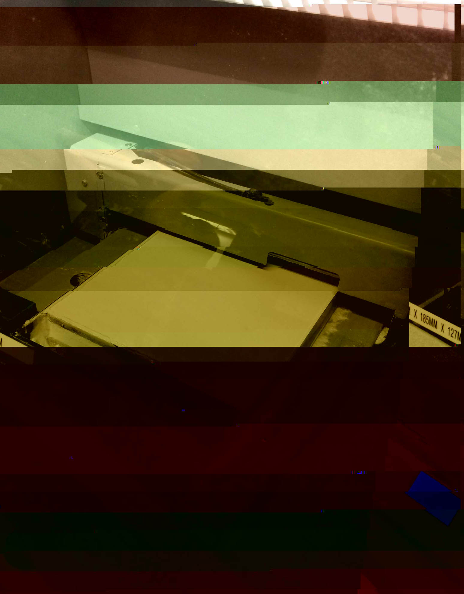
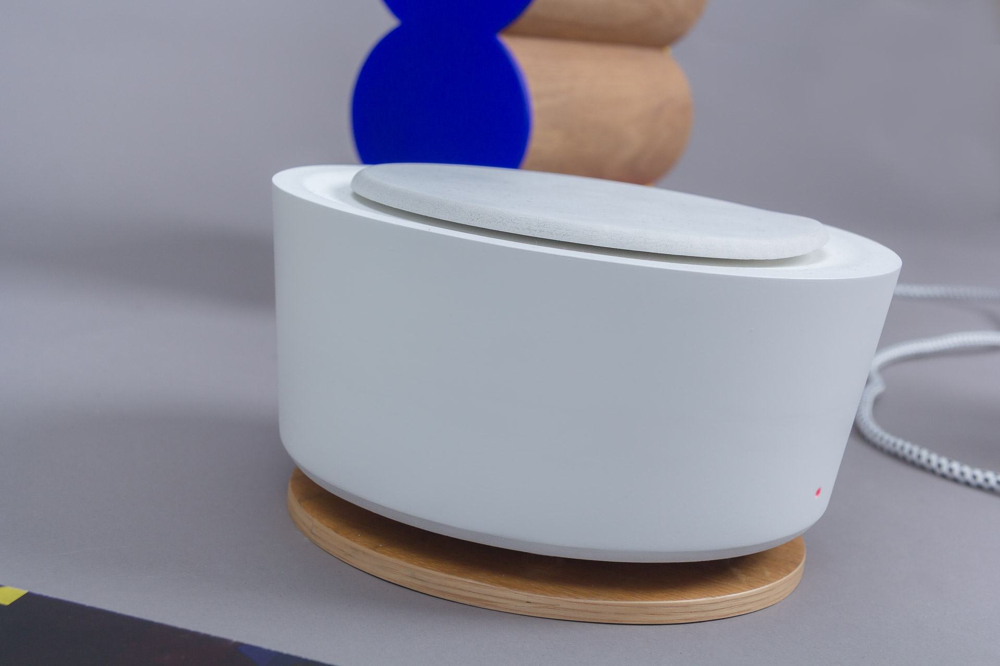
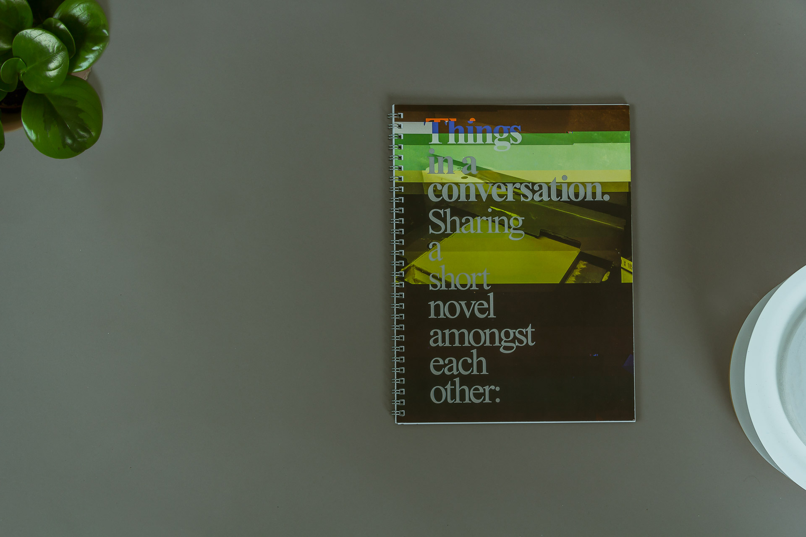
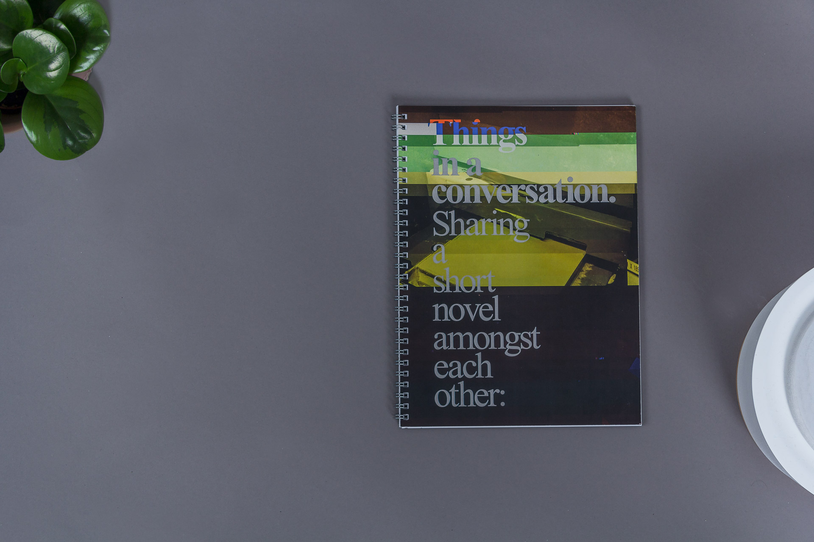
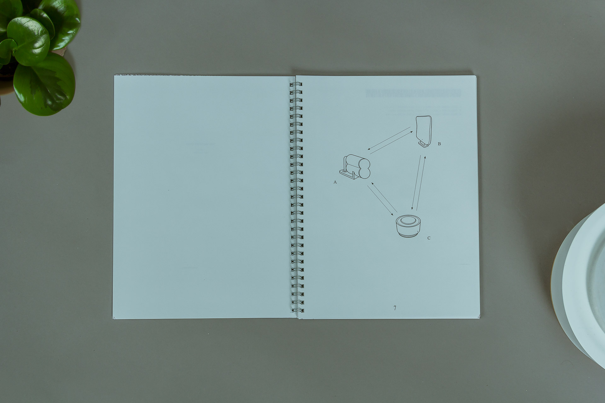
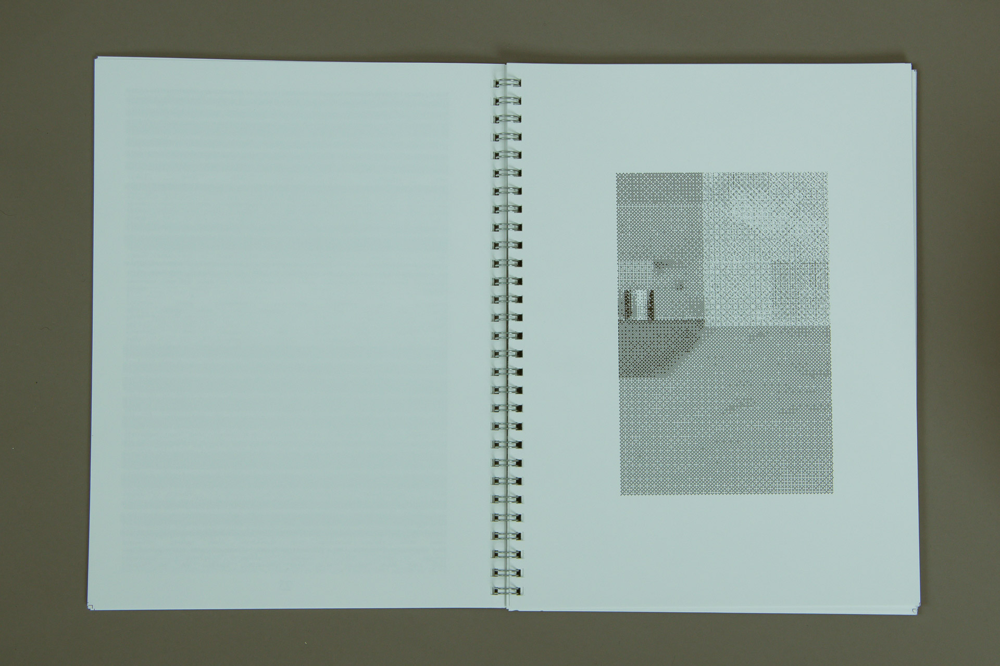
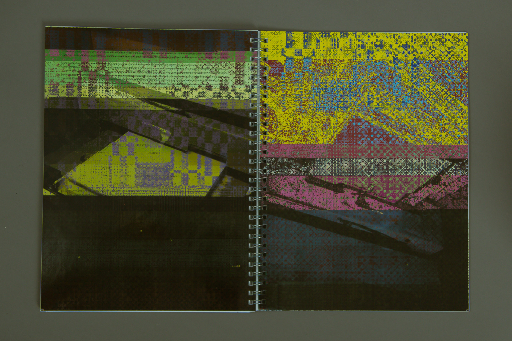

### About

Conversing is probably not an activity that would be expected between any objects, hence it breaks with certain preconceived expectations. Both in how the objects could be understood, but also in how the perception of the conversation is to be interpreted in this situation. What are they, and what are they talking about?

#### Role

Design and manufacturing of artifacts with CNC and wood work craft tools. Design and production of sprial book.

