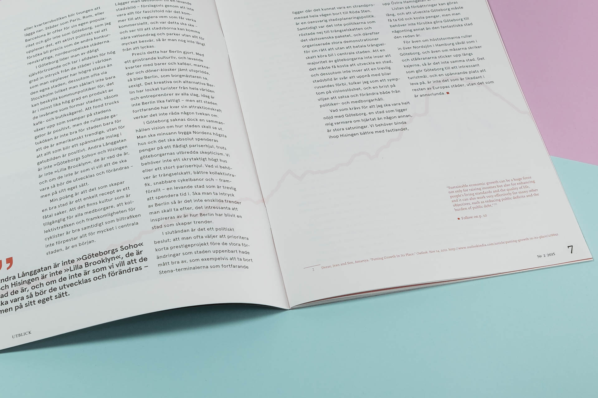

### About
The theme for this number of Utblick Magazine was Responsibility and Growth on different levels. Illustrations of plants and greenery was made and used throughout the number. 
The magazine was printed on a uncoated paper using two Pantone colors and black. 
#### Role
Art Direction and Illustration

> My quote Ullamco aliqua quis consequat duis proident eu laborum. Incididunt ad eu cupidatat mollit. Enim duis voluptate exercitation id cupidatat labore nulla esse do consectetur sint.

