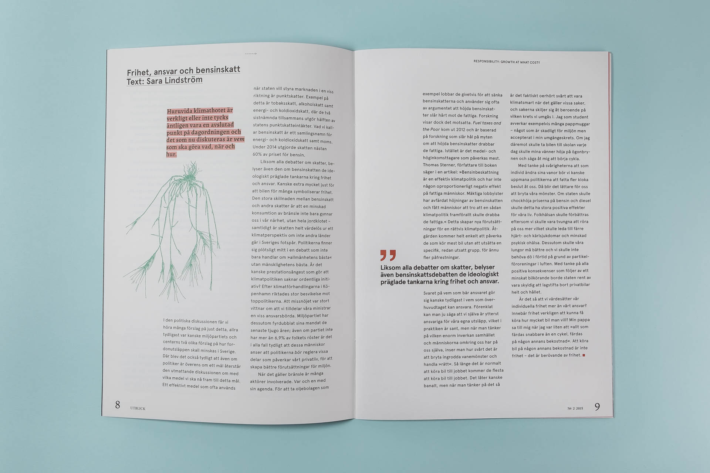
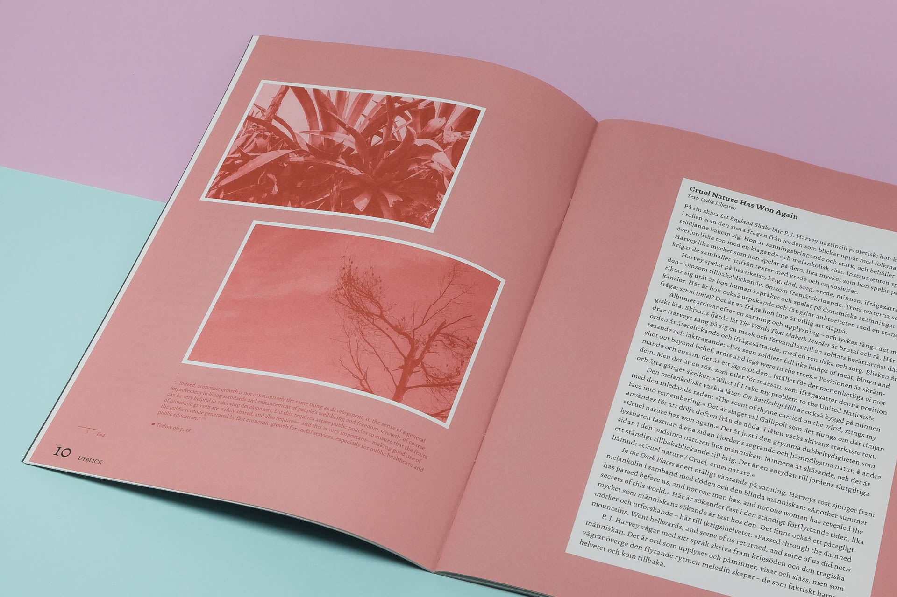

### About
Utblick no.2 explores the theme of Responsibility and Growth through typographic hierarchy and organic illustration. The editorial design balances structured text layouts with hand-drawn botanical elements, creating rhythm through the publication while maintaining readability.

Working with a limited color palette—two Pantone spot colors and black on uncoated paper—the design emphasizes material quality and print craft. The typographic system creates clear hierarchies between article text, quotes, and editorial content, while the organic illustrations provide visual breathing space without disrupting the reading experience.

This project demonstrates how editorial design principles—establishing hierarchy, pacing content, and guiding the reader—translate directly to designing digital products. The medium changes, but the fundamental approach to structure and user experience remains the same.
<!--more-->

