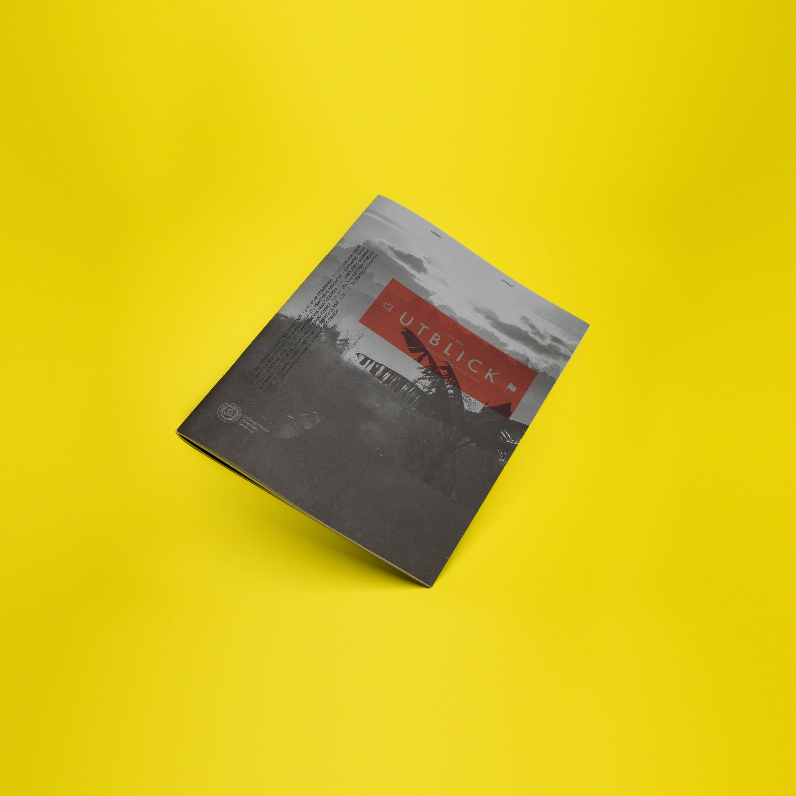

### About
Utblick no.4 "Africa?" explores the complexity of a continent often reduced to singular narratives. The editorial design reflects this theme through bold geometric patterns and warm earth tones, creating visual rhythm while maintaining the structured clarity needed for political journalism.

Working with a limited palette—warm orange and black on uncoated paper—the design emphasizes materiality and craft. Hand-drawn map elements and geometric motifs provide visual breaks between articles without overwhelming the content. The typographic system balances dense political analysis with breathing space, using clean hierarchies for article text, editor's notes, and quoted material.

This issue demonstrates how editorial design can support complex subject matter—creating a consistent visual language while allowing the content's nuance to remain central.
<!--more-->

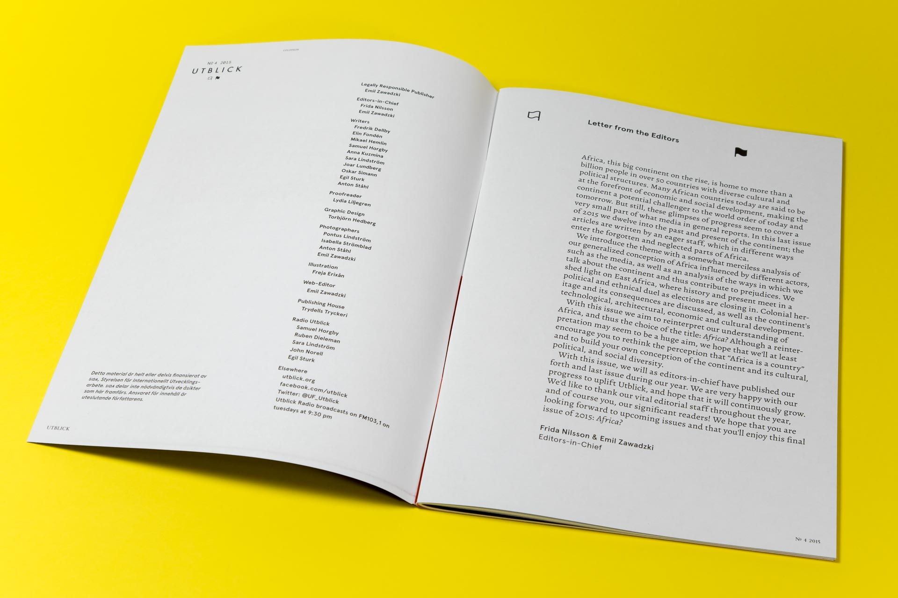
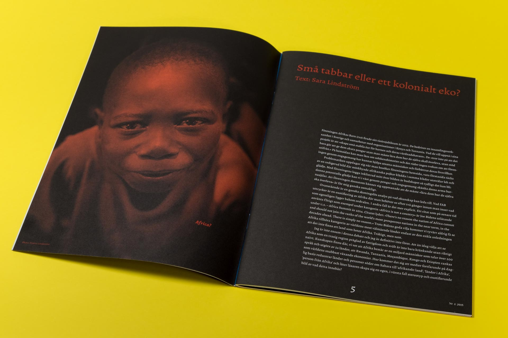
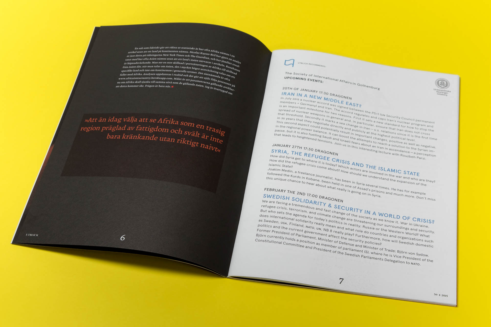
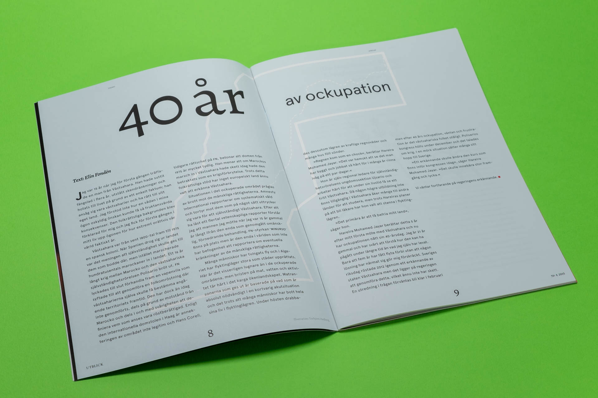
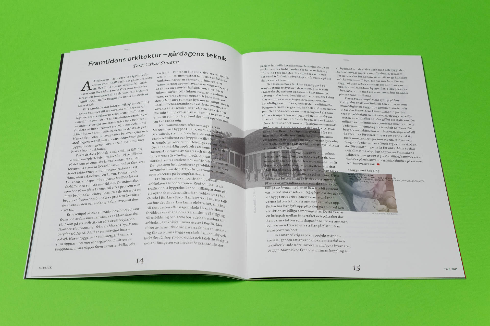
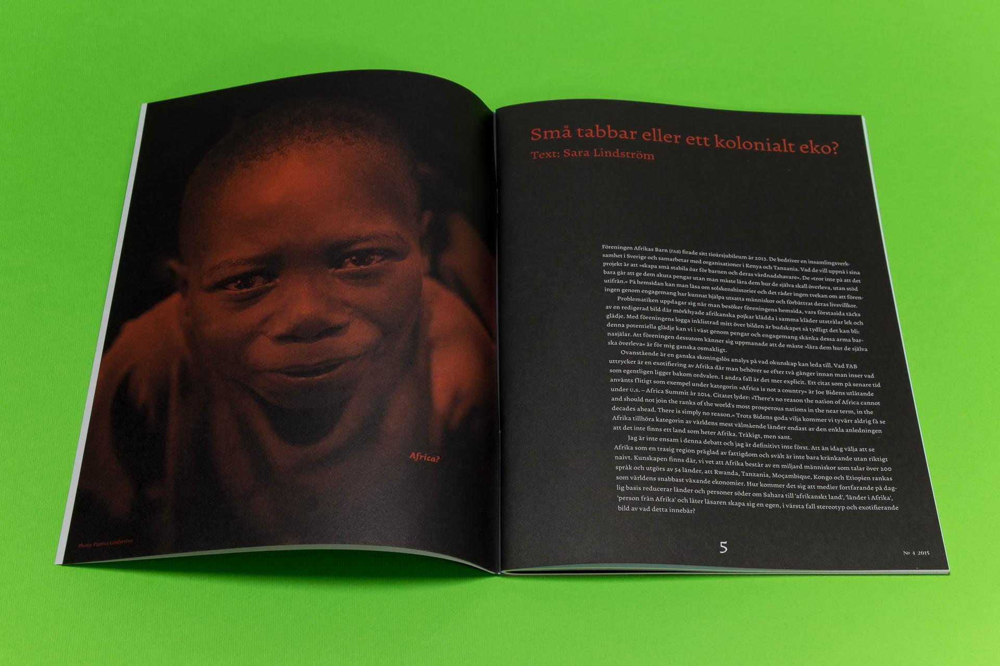
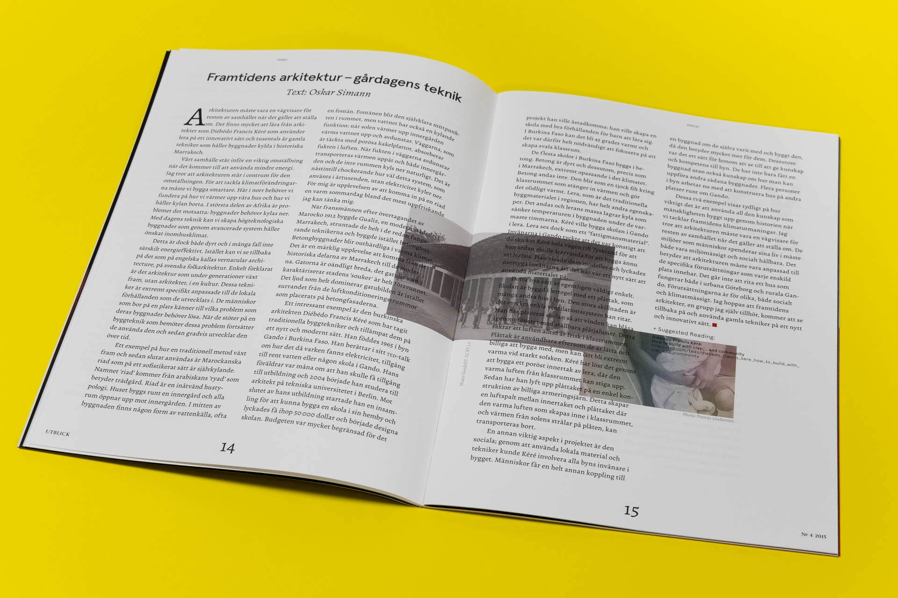
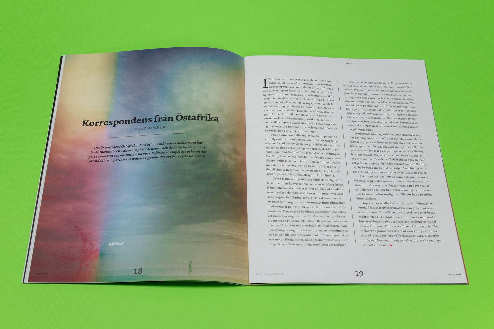
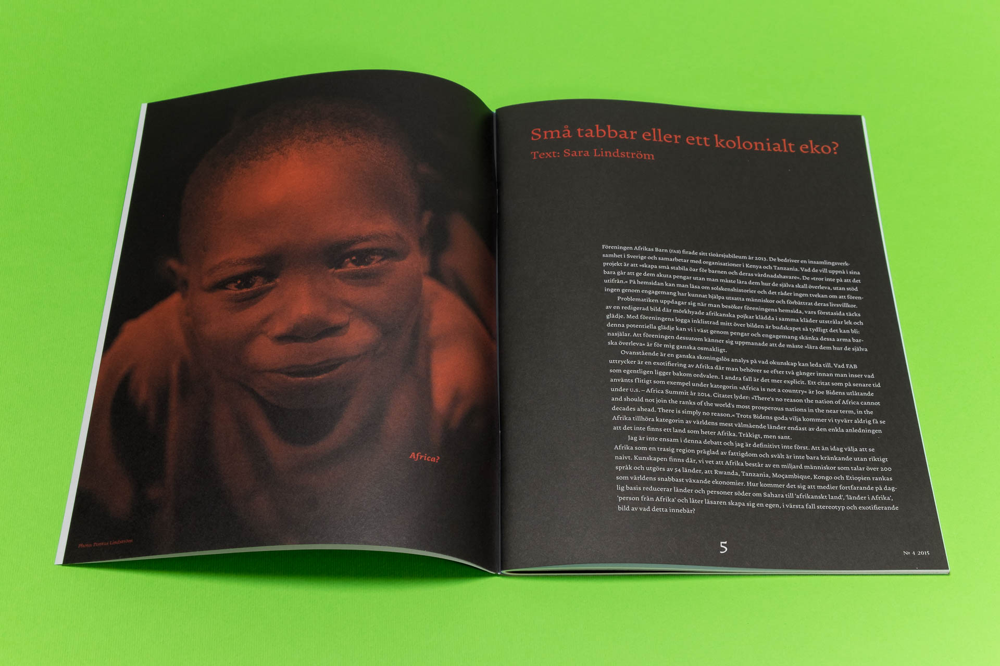
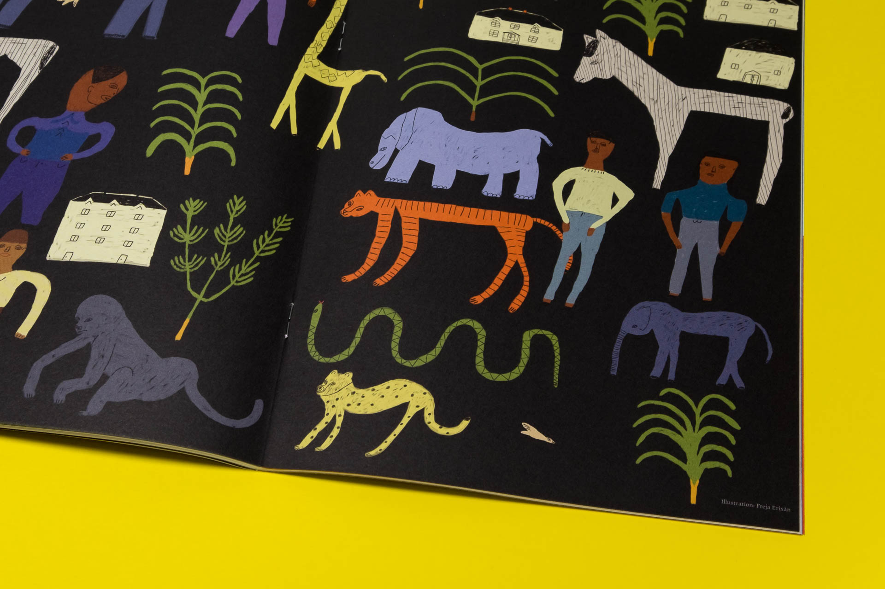
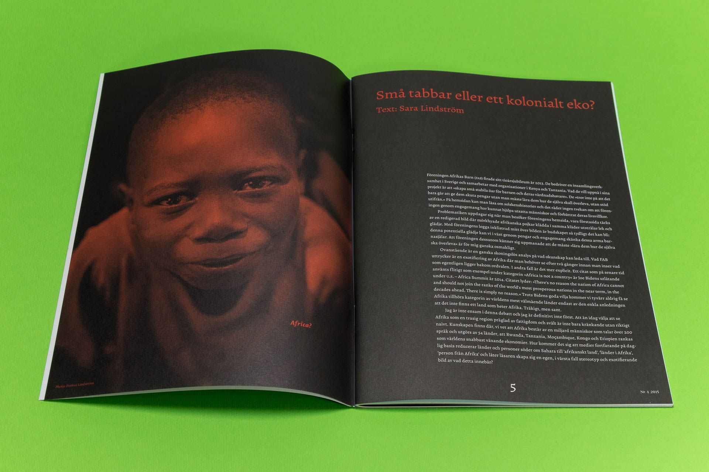
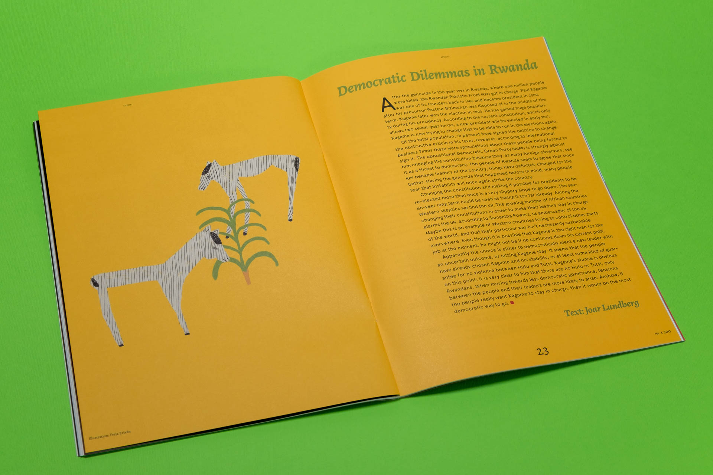
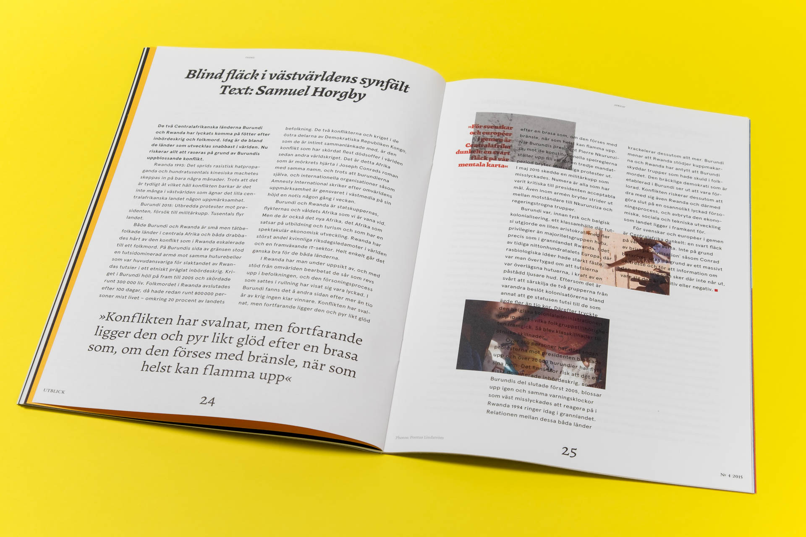
