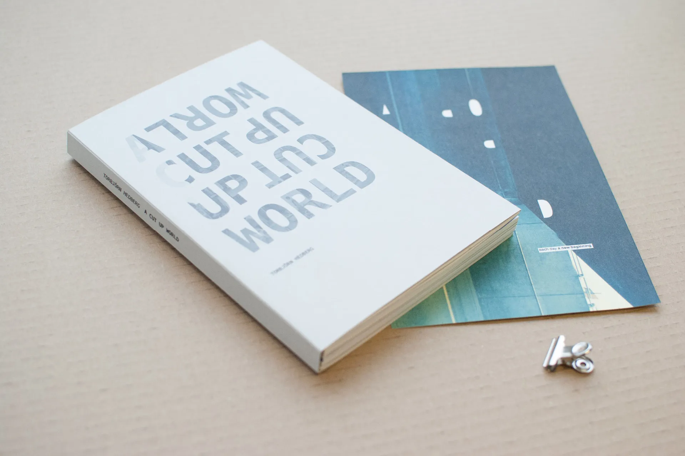
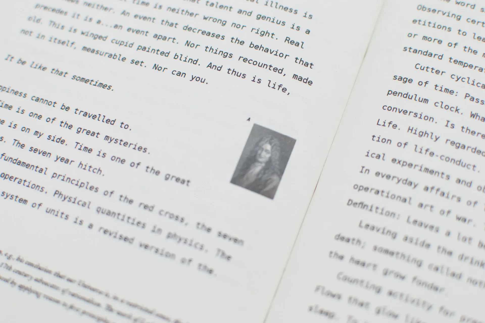

{.myclass}

### Om
A Cut up World är ett examensarbete som undersöker hur digitala verktyg formar berättande och identitet. Genom att använda Googles sökförslag som källmaterial tillämpar boken cut-up teknik för att skapa fragmenterade berättelser som speglar vår relation till algoritmiska system.

Bokdesignen återspeglar denna fragmenterade digitala verklighet genom collage, typografi och blandade medier. Digitala skärmdumpar sitter sida vid sida med analoga texturer, vilket skapar visuell spänning mellan skärm och tryck. Layouten omfattar diskontinuitet—sidor bryts isär, överlappar och kombineras om, vilket gör att läsaren aktivt måste sätta samman mening snarare än att passivt konsumera den.

Detta projekt representerar en tidig utforskning av hur design kritiskt kan engagera sig med teknologi snarare än att bara illustrera den—en tråd som löper genom mitt arbete från tryck till digital produktdesign.
<!--more-->

