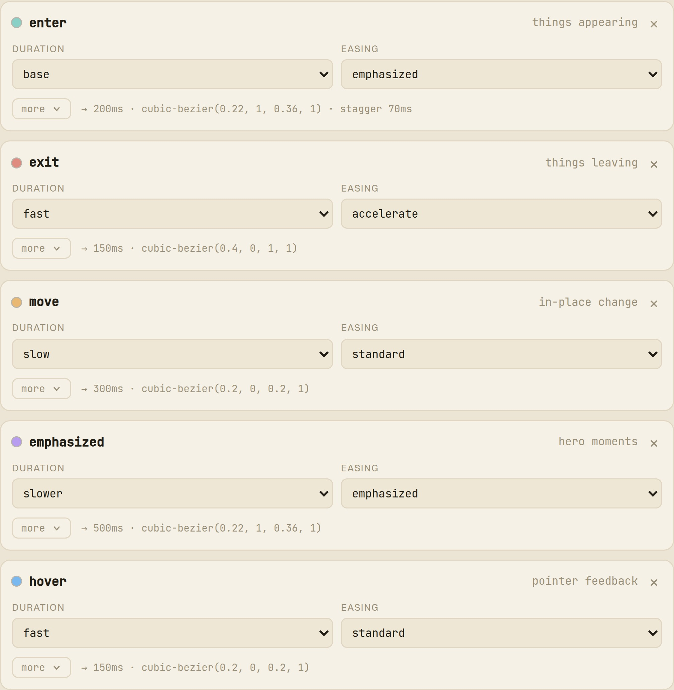



Färg och typografi är lösta problem i ett designsystem – tokeniserade, dokumenterade, återanvända. Det är inte rörelse. Den är fortfarande copy-pastade magiska siffror: en `cubic-bezier` här, ett `300ms` där, intrimmat på känsla och aldrig nedskrivet. **Cadence** är mitt svar på det gapet – ett verktyg som behandlar rörelse som ett designsystem behandlar allt annat, och som sedan har en åsikt om resultatet.

### Matematiken tar dig 80 %

De flesta rörelseverktyg ger dig en kurva i taget. cubic-bezier.com, easings.net – en enda easing, isolerad. De är kalkylatorer, inte system. Och matematiken är den lätta delen: vilken generator som helst spottar ur sig en rimlig kurva. De sista 20 % – det som får rörelse att kännas *genomtänkt* snarare än slumpmässig – är art direction: hur hela uppsättningen hänger ihop, vilka varaktigheter som passar med vilka easings, om att komma in och lämna känns medvetet olika. Inget verktyg gjorde det läsbart eller återanvändbart, så rörelse förblir stamkunskap – återuppfunnen per komponent, som glider isär över tid.

### Två lager av tokens

Cadence lånar strukturen ett designsystem redan använder för färg – **primitiver → semantiska tokens** – och applicerar den på rörelse.

**Primitiver** är vokabulären: en varaktighetsstege och en uppsättning easings, komponentoberoende. Varje easing skapas direkt genom att dra i kontrollpunkterna, med utrymme för overshoot; en easing kan till och med vara en fjäder, samplad till CSS `linear()` så att riktig fysik animeras nativt.

**Intents** är semantiska tokens – `enter`, `exit`, `move`, `emphasized` – komponerade *by reference* från primitiverna (`enter = duration.base + emphasized`). Det är här art direction bor: du namnger *mening*, inte siffror, och siffrorna stannar på ett ställe.

Det svåraste beslutet var vad man skulle göra med komponenter. En tidig version hårdkodade fyra roller till fyra demokomponenter – och sprack i samma stund du föreställde dig en femte. Så jag degraderade komponenter till en **utbytbar bänk av abstrakta instrument**: varje prob är en *lins* riktad mot ett intent, som isolerar en enda mätbar egenskap – kurvan, staggern, förflyttningen – i stället för att återuppföra en UI. Organisera kring token-arkitekturen, så kan inget hamna utanför.

### Åsiktslagret

Generatorer genererar; de dömer inte. Den del jag bryr mig mest om är **system read** – ett åsiktslager som kritiserar hela systemet snarare än en enda kurva. Är stegen jämnt fördelad? Är två easings i hemlighet samma? Lämnar *exit* snabbare än *enter* anländer? Är varaktighetsbudgeten förbi ~550 ms-gränsen där "nu väntar jag"?

Fynden rankas värst-först, var och en bär en enradsfix – de flesta med en **Apply** i ett klick – och en jämförande läsning benchmarkar systemet mot riktiga (Material, Carbon, Fluent…) så att siffrorna får en referensram. Att koda en art directors öga som checkar är hela tesen: ett verktyg som säger dig vad du ska *göra*, inte bara vad som är fel.

### Från system till levererad kod

Ett rörelsesystem spelar bara roll om det levereras. Cadence exporterar token-uppsättningen som CSS custom properties – semantiska intents som `var()`-refererar primitiverna, precis som du skulle skriva dem för hand – plus JSON, en Tailwind-config, en Style Dictionary-fil och ett typat TS-objekt, som var och en kopieras eller laddas ner under sitt konventionella filnamn.

Och det är inte bara kurvor i en panel: en levande demo-yta driver riktiga komponenter med systemet och tajmar om medan du redigerar.

### Jag körde det på min egen sajt

Det starkaste testet var att vända det mot mig själv. Jag klistrade in **den här portföljens** rörelse-tokens i Cadences palett-läsare och körde samma kritik över dem.

Det gav dem **B – 88/100**, bekräftade att varaktighetsstegen växer i en sund takt på ~1,3× per steg (mitt i intervallet som Spectrum, Polaris och Fluent använder) – och fångade något jag missat: två av mina easings, `accelerate` och `exit`, är nästan exakt samma kurva. En stramare uppsättning är lättare att applicera konsekvent; fixen var att ta bort en. Det är hela poängen med övningen – åsiktslagret gör riktigt arbete på riktiga tokens, inklusive mina egna.

**Live:** [cadence.tor2dbear.com](https://cadence.tor2dbear.com) · **Källkod:** [github.com/tor2dbear/cadence](https://github.com/tor2dbear/cadence)
