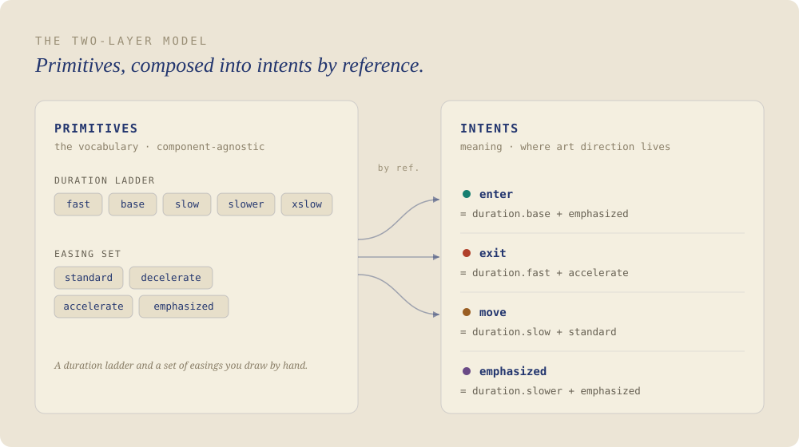
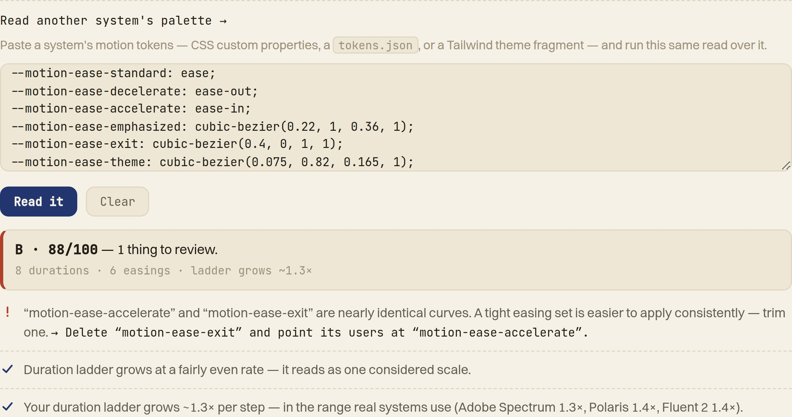



Rörelse är det sista osystematiserade hörnet av ett designsystem. Färg har tokens; typografi har en skala. Rörelse är fortfarande magiska siffror – en `cubic-bezier` intrimmad på känsla, inklistrad ur minnet, aldrig nedskriven. **Cadence** behandlar den som resten av systemet, och ger den en åsikt.

Två lager, lånade från hur vi redan hanterar färg. *Primitiver* är den råa vokabulären: en varaktighetsstege och en uppsättning easings du ritar för hand. *Intents* är meningen – `enter`, `exit`, `move` – komponerade från primitiverna by reference. Du namnger vad rörelse är *till för*, inte vad den *är*; ändra en primitiv och hela systemet tajmar om.

Beslutet jag är mest nöjd med var att sluta designa kring komponenter. En tidig version låste fyra roller till fyra demokomponenter och föll ihop i samma stund jag föreställde mig en femte. Så komponenter blev en bänk av instrument – var och en en lins på en enda egenskap hos en token, aldrig en skärm att återuppföra. Organisera ett system kring sina egna tokens, så kan inget hamna utanför.

De flesta verktyg genererar; de dömer inte. Den del jag är stoltast över är den med en synvinkel: den läser hela uppsättningen och säger var det skaver – en easing som i hemlighet är två, ett exit som är långsammare än sitt entré, en stege som haltar – och *vad den skulle ändra*, inte bara vad som är fel. Att koda in det omdömet – en art directors öga som en handfull checkar – är hela idén.

Inget av det stannar i verktyget. Cadence exporterar den CSS du skulle ha skrivit för hand, och driver en riktig produktyta så att du kan känna systemet snarare än bara läsa det.

Det verkliga testet var att vända det mot mig själv.

Jag klistrade in den här sajtens egna rörelse-tokens. Den gillade rytmen – och ertappade mig med att vara lat: två av mina easings är, i tysthet, samma kurva. Ett verktyg värt att lansera ska kunna genera sin skapare. Det här gjorde det.

**Live:** [cadence.tor2dbear.com](https://cadence.tor2dbear.com) · **Källkod:** [github.com/tor2dbear/cadence](https://github.com/tor2dbear/cadence)
