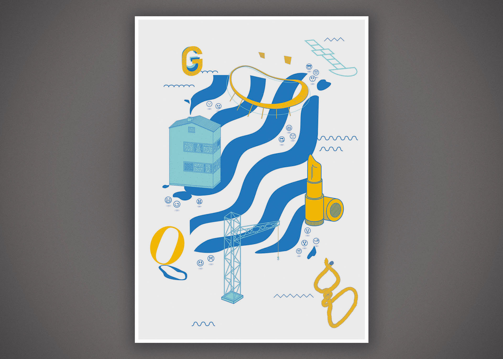
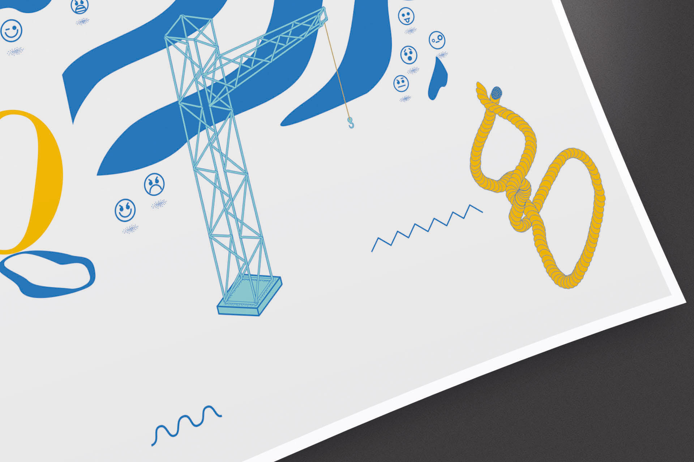

### Om

Ett självinitierat affischprojekt som skildrar Göteborgs landmärken och symboler. Illustration och grafisk form kombineras för att hylla stadens karaktär – arkitekturen, vattenvägarna och kulturella referenserna.








