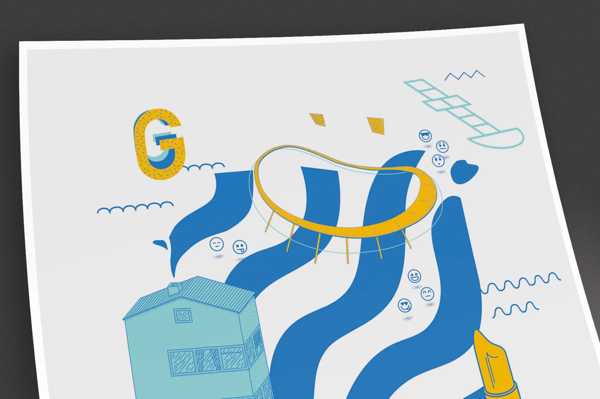

## Introduction

This tutorial will show you how to create a simple theme in Hugo. I assume that you are familiar with HTML, the bash command line, and that you are comfortable using Markdown to format content. I'll explain how Hugo uses templates and how you can organize your templates to create a theme. I won't cover using CSS to style your theme.

We'll start with creating a new site with a very basic template. Then we'll add in a few pages and posts. With small variations on that, you will be able to create many different types of web sites.

In this tutorial, commands that you enter will start with the "$" prompt. The output will follow. Lines that start with "#" are comments that I've added to explain a point. When I show updates to a file, the ":wq" on the last line means to save the file.