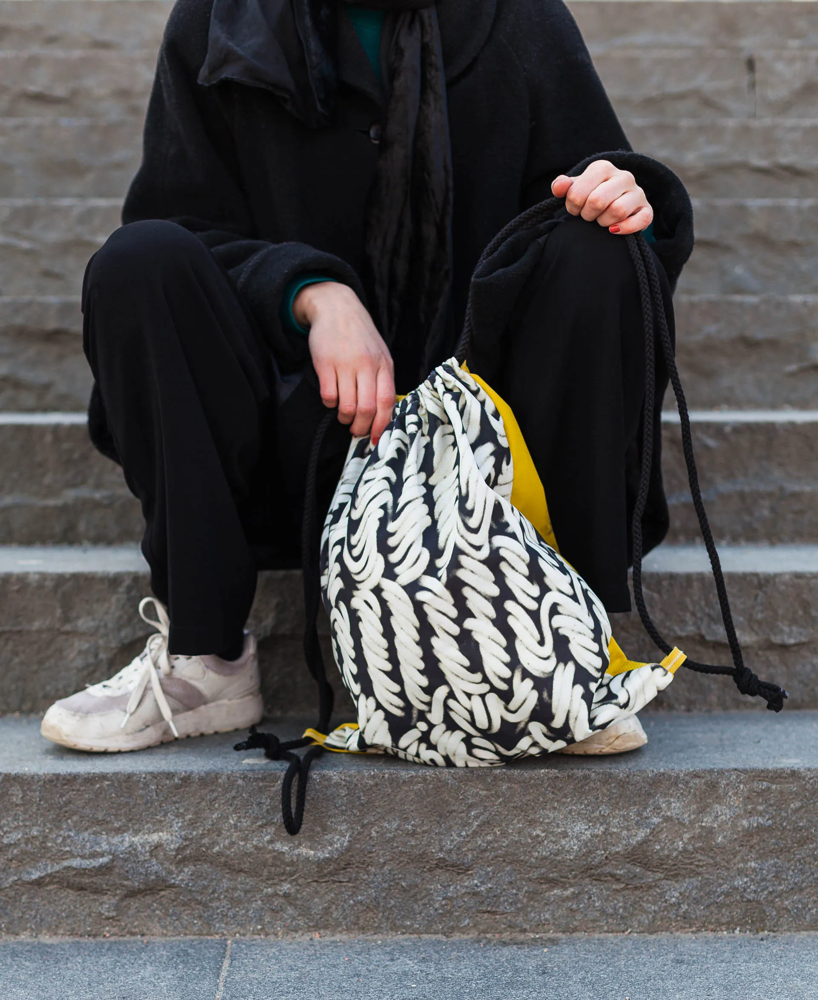

### Om

*In the City* är ett magasin och en av tre publikationer i MFA-examensarbetet *One Stack. Two Stack. Three Stack.* (HDK, Göteborgs universitet, 2016). Magasinet dokumenterar en begränsad period och en promenad i Backaplan, Göteborg — i första hand genom fotografi.

Layouten leker med magasinssidans begränsningar som yta och placerar element ovanpå varandra för att kommentera hur staden fungerar som ett gränssnitt. Där det tredimensionella stadsrummet låter betraktaren röra sig mellan lagren, kollapsar den tryckta sidan dem — bilder trycks ovanpå bilder och innehåll flyr ut mot sidränderna.

#### Roll

Art Direction och illustration

