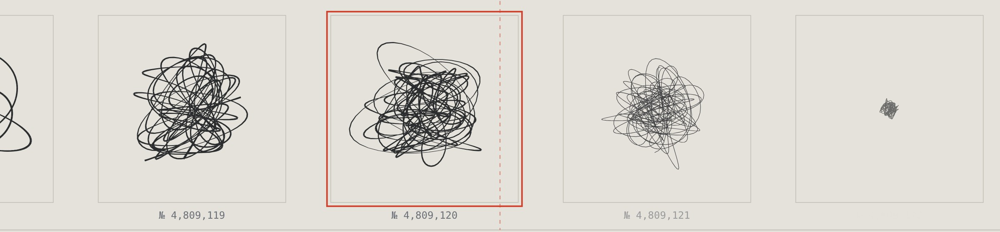



1959 byggde **Jean Tinguely** maskiner som ritade abstrakt konst på löpande band — _Méta-Matics_, ett skämt om det spontana geniet. Méta-Matic ∞ är samma skämt, omställt för AI-eran. Maskinen ritar också. Men den _slumpar_ inte fram sina verk; den _hämtar_ dem ur ett kontinuerligt rum där varje möjlig teckning redan är en punkt. Att gå framåt är att interpolera. Frågan är inte längre Tinguelys "vad är konst när en maskin kan göra det?" utan: **oändligt många, aldrig något nytt — var finns originalet?**

Varje verk ritas med staplade epicykler vars parametrar hämtas ur ett kontinuerligt brusfält — grannkoordinater ger nästan identiska teckningar, så bandet **morfar** snarare än hoppar. Och det drivs av väggklockan, inte av besökaren: serienumret är en funktion av tiden, alltså samma verk för alla just nu, helt utan server. Du kan titta bort, men inte stoppa maskinen — räknaren tickar vidare, och när du tittar tillbaka har den ritat utan dig. "Verk producerade" stiger. **Original förblir noll.**

Det enda du kan göra är att _plocka_ ett verk: granska det stort, signera det, spara det. Signaturen gör det till ditt — ingenting gör det till ett original. Grannpunkten är omöjlig att skilja från din, och en minikarta visar hur din väg genom rummet ständigt korsar sig själv: inga kanter, allt återkommer.

Där sitter åsiktslagret, och det är hela poängen. Du kan signera med plånbok, eller — i den skarpa versionen — minta verket som NFT. Det undergräver inte pjäsen; det _fullbordar_ satiren: att betala riktiga pengar för att tillverka ägande och knapphet åt något som aldrig var nytt. En global räknare visar hur många gånger _just det verket_ redan signerats. Ditt unika plock var redan plockat.

En ärlig fotnot, för det hör till verket: det "latenta rummet" är matematiskt simulerat, inte en riktig modell. Det spelar ingen roll för poängen — och att säga det högt är en del av den.

**Live:** [meta-matic.tor2dbear.com](https://meta-matic.tor2dbear.com) · **Källkod:** [github.com/tor2dbear/meta-matic](https://github.com/tor2dbear/meta-matic)
