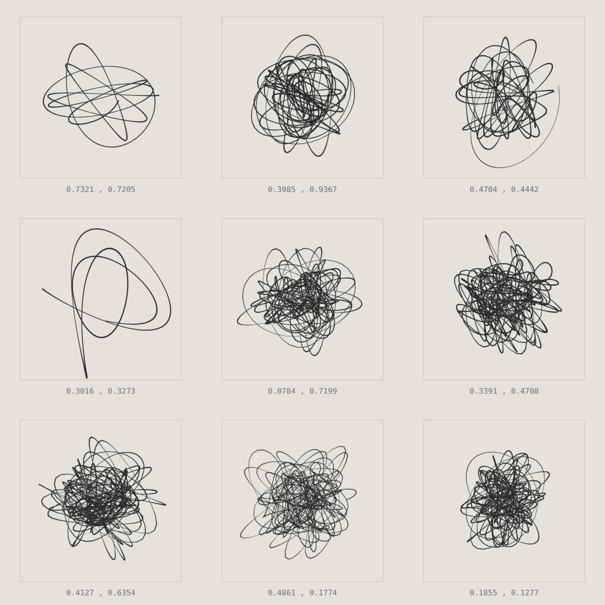



1959 byggde **Jean Tinguely** maskiner som ritade abstrakt konst på löpande band — _Méta-Matics_, ett skämt om det spontana geniet. Méta-Matic ∞ är samma skämt, fast flyttat till AI-eran. Maskinen ritar också. Men den _slumpar_ inte fram sina verk; den _hämtar_ dem ur ett kontinuerligt rum där varje möjlig teckning redan är en punkt. Att gå framåt är att interpolera. Frågan är inte längre Tinguelys "vad är konst när en maskin kan göra det?" utan: **oändligt många, aldrig något nytt — var finns originalet?**

Varje verk ritas med staplade epicykler vars parametrar hämtas ur ett kontinuerligt brusfält — grannkoordinater ger nästan identiska teckningar, så bandet glider snarare än hoppar. Och det drivs av väggklockan, inte av besökaren: serienumret är en funktion av tiden, alltså samma verk för alla just nu, helt utan server. Du kan titta bort, men inte stoppa maskinen — räknaren tickar vidare, och när du tittar tillbaka har den ritat utan dig. "Verk producerade" stiger. **Originalen förblir noll.**

Det enda du kan göra är att göra ett verk till ditt: granska det stort och **certifiera** det. Varje verk kan certifieras exakt en gång — först till kvarn, en enda ägare. Ett äkthetsbevis för något oändligt kopierbart. Det _är_ skämtet.

Och ironin överlever exklusiviteten: det du äger är det enda exemplaret, helt äkta — men grannpunkten, en nära-dubblett som ständigt återkommer, går inte att skilja från det. Ett original som ändå är visuellt banalt.

Att certifiera går på två sätt, samma ägande oavsett vilket: direkt i webbläsaren, eller med en plånbokssignatur — gratis, ingen gas, en verifierbar och frivillig nick åt NFT, aldrig en grind. En räknare visar hur många som certifierats totalt, och _The Space_, koordinatsystemet, ritar ut allas certifierade punkter jämte dina: inga kanter, allt återkommer; en väg, som alla går. Försöker två certifiera samma verk samtidigt vinner en; den andra får veta att det togs 40 ms tidigare — oändligt många andra återstår.

En ärlig fotnot, för den hör till verket: det "latenta rummet" är matematiskt simulerat, inte en riktig modell. Det spelar ingen roll för poängen — och att säga det högt är en del av den.

**Live:** [meta-matic.tor2dbear.com](https://meta-matic.tor2dbear.com) · **Källkod:** [github.com/tor2dbear/meta-matic](https://github.com/tor2dbear/meta-matic)
