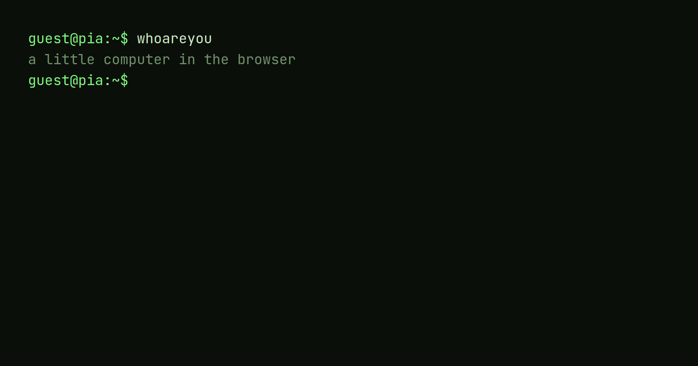
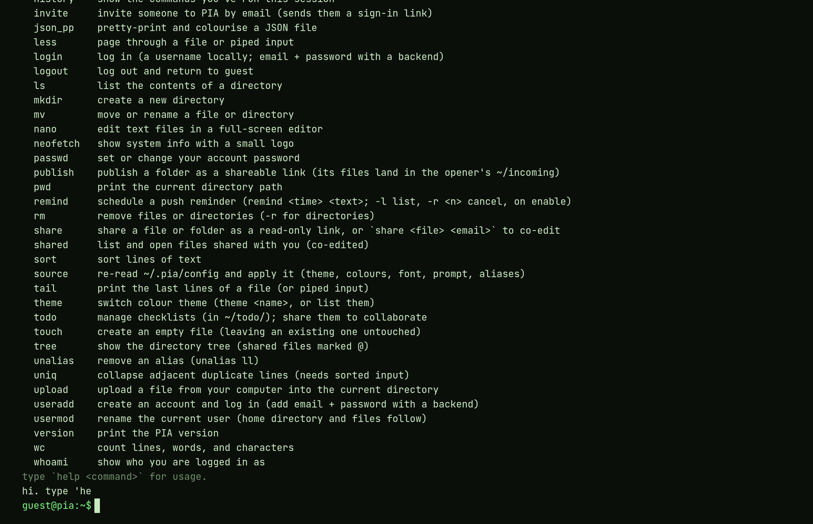
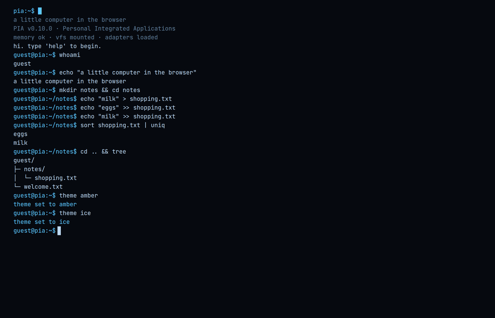

### Översikt

PIA är en fungerande liten dator som lever helt i webbläsaren. Man loggar in på en prompt, navigerar ett filsystem, redigerar filer och kör kommandon med pipes (`sort fruit.txt | uniq`) — ingen backend krävs för att komma igång. Loggar man in synkar allt till molnet; annars kör allt lokalt.

Namnet är en blinkning till Apples *Lisa* — PIA står för *Personal Integrated Applications*.

**Det är lika mycket en designstudie i konsekvens som en produkt.** En enda regel — *terminal-idiom först* — får styra varenda beslut, ända in i arkitekturen. Det här caset handlar om vad den enda regeln köpte, och vad den kostade. Det är också det tydligaste argument jag kan ge för hur jag angriper produkter: välj en princip, tryck in den i arkitekturen, och låt strukturen — inte viljestyrkan — hålla ihop det hela när det växer.

### Idén

Jag ville se hur långt man kan ta "en dator i en flik" om man vägrar att fuska — inte en leksaks-terminal med ett par påhittade kommandon, utan något som beter sig som ett riktigt skal: samma namn, flaggor och flöden som en Unix-miljö, men som råkar bo i webbläsaren och funkar med tummen på en telefon.

**Spänningen är att två världar krockar.** Terminalen är tangentbord, text och konventioner från 1970-talet. Webben är touch, delningslänkar, e-postinlogg och hemskärms-appar. Hela designarbetet är att låta det ena styra utan att förråda det andra.

### Designprincipen: terminal-idiom först

Varje kommando följer Unix-konvention — **namn, flaggor och beteende.** Hellre det riktiga terminalnamnet (`nano`, `useradd`, `grep -n`) än en vänlig webb-uppfinning (`edit`, `register`, en GUI-genväg). Vänliga namn får finnas kvar som *alias*, aldrig som det primära.

Det låter strikt, och det är poängen. **Konsekvens är en funktion:** kan man en sak kan man gissa nästa. Editorn är `nano` (`^O` sparar, `^X` avslutar). Kontoskapande är `useradd`. Prompten är `user@pia:~$`. Inställningar bor i en `.pia/`-dotfil. Det är samma muskelminne som ett riktigt skal.



**Det svåraste beslutet var vad man gör när det *inte* finns någon terminal-motsvarighet.** E-post, lösenord och bekräftelsemejl är ren webb. `share`/`publish` som returnerar en URL har ingen skal-motsvarighet. Touch-knappar likaså. I stället för att klä upp dem till något de inte är är regeln rak — och det är skillnaden mellan en produkt med en åsikt och en hög funktioner.

> Flagga avvikelsen och gör den till ett medvetet, dokumenterat beslut — inte en glidning.

### Arkitektur som designbeslut

**Den mest designade delen av PIA syns inte på skärmen: adaptrarna är sömmen.** Terminalen rör aldrig lagring eller inloggning direkt — bara gränssnitten `StorageAdapter` / `AuthAdapter` / `ShareStore`. Varje kommando når världen genom ett litet, definierat `CommandContext` (skriv ut, filsystem, auth, stdin …), aldrig via DOM:en.

**Det gör en stor produktförändring till ett byte, inte en omskrivning.** Gäster kör lokala adaptrar; inloggade användare kör moln-adaptrar (Supabase) — bakom exakt samma gränssnitt. Fullskärmsappar (editorn, spelen) är "bara ännu en skärm-app" som tar över via samma mekanism, så nya verktyg kostar nästan ingenting att lägga till.

För en designer är det här kärnan: **struktur är det som gör att produkten kan växa utan att förfalla.** Sömmen är osynlig, men den är anledningen till att allt annat känns lätt.

, bakom samma kontrakt.")

### Utvalda designbeslut

**Teman är fem tokens, inte ett omskal.** Fyra CRT-inspirerade paletter (grön fosfor, bärnsten, is, gråskala) sätter var och en bara fem färg-tokens — resten av gränssnittet följer med automatiskt. De två rutorna nedan är *samma session* i två av paletterna: inget stylas om per tema, tokens kaskaderar bara. Typsnittet är JetBrains Mono, självhostat så det renderar för alla inom en strikt säkerhetspolicy (CSP), och delat med den här portfolion för en sammanhållen känsla.




**Editorn är `nano` på riktigt.** Fullskärmsappar tar över via samma mekanism som allt annat och ärver temat gratis, så editorn håller idiomet intakt: `^O` sparar, `^X` avslutar, rad och kolumn i statusraden.


**Touch-baren är kontext-medveten — en webb-avvikelse, medvetet gjord.** På ett fysiskt tangentbord göms den helt (Tab, pilar och pipe finns redan på tangenterna). På touch dyker den upp, grupperad i logiska kluster med hårfina avdelare: *komplettering · navigering · skiljetecken · kontroll*. Kontroll-gruppen är en enda `ctrl`-knapp som fäller ut hela readline-uppsättningen (`^A ^E ^U ^K ^W …`), så baren förblir ren fast funktionaliteten växer.


**Samma app, olika hem.** Installerad på iOS-hemskärmen finns ingen webbläsar-chrome att luta sig mot. `display-mode: standalone` plus riktig hantering av "safe area" (kamerahål, home-indicator) gör att allt sitter kant-i-kant — medan webbläsarläget lämnas orört. Och **push är på riktigt:** påminnelser (`remind`) och samarbets-notiser når telefonen via Web Push även när fliken är stängd — samma terminala kommando, en molnfunktion under huven.

### Utmaningar och avvägningar

**När idiomet tar slut.** Att bjuda in någon till en delad checklista (`todo share <namn> <e-post>`) har ingen ren Unix-motsvarighet — närmaste släkting är `chmod`/`chown`. Det blev en medveten, dokumenterad webb-avvikelse snarare än en tvingad metafor. Samma sak med filuppladdning som når OS:ets filväljare: namngiven rakt på, inte förklädd till `scp`.

**QR-koden som inte gick att skanna.** Min första handkodade QR-generator producerade koder som såg rätt ut men inte lät sig läsas. I stället för att jaga buggen i det oändliga bytte jag till ett beprövat bibliotek och verifierade med en riktig skanner i test — rätt beslut framför prestige.

**Python i webbläsaren.** Python körs via Pyodide (WASM) i en isolerad, självhostad sandlåda — ingen extern CDN, allt inom samma säkerhetspolicy som resten.

### Kvalitet: testet som läses som en rundtur

Det mest ovanliga beslutet är hur PIA verifieras. **Hela produkten körs igenom via en enda skriptad session** i den riktiga terminalen, sparad som en läsbar utskrift ("the tour"). Lägger man till en funktion lägger man till rader i den sessionen och granskar diffen mot den sparade utskriften — den diffen *är* verifieringen. Klockan är fryst och flyktig utdata maskeras, så det enda som ändras är verkligt beteende. Resultatet är ett regressionstest som också läses som en guidad rundtur av produkten.

```diff
 guest@pia:~$ at now+5m echo remember
 scheduled for Sat Jul 18 12:05 UTC 2026
   echo remember
+guest@pia:~$ remind now+1h standup
+remind: reminders need a cloud account — run `login`
```

*Ett äkta utdrag ur touren: att lägga till `remind` la till de två gröna raderna — och den ärliga gäst-avböjningen är beteendet som testas. Den frysta klockan håller diffen stabil; den granskade diffen är verifieringen.*

Ovanpå det: typkontroll, enhetstester och manuell verifiering i en riktig webbläsare för det som testerna inte kan se (färger, WASM, PWA-beteende). Allt landar via gren → PR → CI → merge, med automatiska förhandsvisnings-URL:er per ändring.

### Vad det bevisar

PIA satte ut att pröva ett påstående: **att en enda, kompromisslös princip — buren hela vägen in i arkitekturen — ger en produkt som känns hel och förblir billig att bygga vidare på.** Två saker håller upp det. För det första gjorde adaptersömmen den största förändringen (gäst → moln) till ett byte snarare än en omskrivning, och gjorde varje nytt spel eller verktyg nästan gratis — strukturen betalade för sig själv. För det andra betyder den skriptade "touren" att varje dokumenterat beteende också är ett test, så konsekvens är inte ett hopp utan något som upprätthålls vid varje merge.

**Den ärliga kostnaden:** idiom-först är en ständig skatt på de webb-inhemska delarna — varje avvikelse (`share`, uppladdning, touch-baren, push) måste argumenteras och skrivas ner i stället för att bara shippas. Just den disciplinen är vad som ger produkten sin åsikt, men den gör det långsammare att lägga till något som inte passar metaforen.

I dag är PIA en deployad, installerbar PWA med ett brett kommandoregister, en editor, delade checklistor i realtid, ett paketsystem med spel och verktyg, Python-stöd, teman och push-notiser — som kör lika bra under tummen som på en desktop. **Bästa sättet att bedöma den är att trycka på några tangenter själv.**

### Nästa steg

- Guidad `demo` som visar upp höjdpunkterna för en förstagångsbesökare.
- Fler readline-genvägar (t.ex. `^R` bakåtsök) — nu triviala tack vare Ctrl-brickan.
- Tillgänglighets- och Lighthouse-pass samt bättre tema-upptäckbarhet.
- Bryta ut kärnmotorn till ett fristående npm-paket.

### Roll

Idé, design, arkitektur och utveckling — solo. Från första prompten till en deployad PWA.
