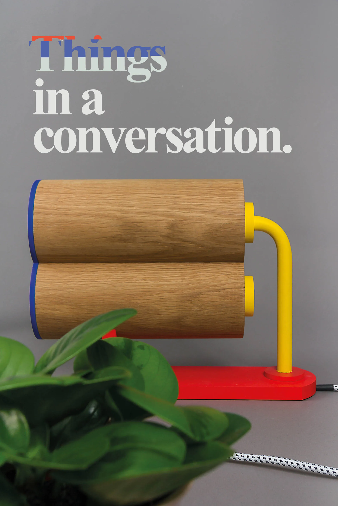

### Om

Att konversera är förmodligen ingen aktivitet man förväntar sig av föremål — det bryter mot förutfattade förväntningar, både i hur föremålen kan förstås och i hur konversationen mellan dem ska tolkas. Vad är de? Och vad pratar de om?

*Things in a Conversation* utforskar dessa frågor genom tillverkade artefakter formgivna med avsiktlig tvetydighet. Estetiska och funktionella 'sprickor' lämnar utrymme för betraktaren att definiera relationen mellan föremålen — de existerar som materialiserade frågor snarare än lösta svar. Projektet tar sin utgångspunkt i framväxten av uppkopplade föremål och det till stor del odefinierade rummet för vad det kan innebära för ting att kommunicera.

#### Roll

Design och tillverkning av artefakter med CNC och trähantverk. Design och produktion av spiralbunden bok.

