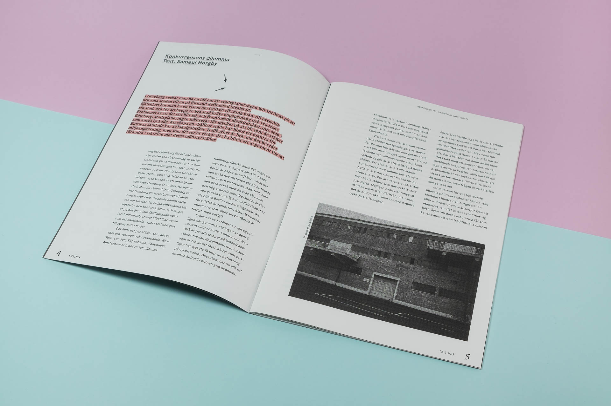

### Om
Utblick nr.2 utforskar temat Ansvar och Tillväxt genom typografisk hierarki och organiska illustrationer. Den redaktionella designen balanserar strukturerade textlayouter med handritade botaniska element, vilket skapar rytm genom publikationen samtidigt som läsbarheten bevaras.

Med en begränsad färgpalett—två Pantone-kulörer och svart på obestruket papper—betonar designen materialkvalitet och tryckhantverket. Det typografiska systemet skapar tydliga hierarkier mellan artikeltext, citat och redaktionellt innehåll, medan de organiska illustrationerna ger visuellt andrum utan att störa läsupplevelsen.

Det här projektet visar hur redaktionella designprinciper—att etablera hierarki, dosera innehåll och guida läsaren—översätts direkt till att designa digitala produkter. Mediet ändras, men det grundläggande förhållningssättet till struktur och användarupplevelse är detsamma.
<!--more-->

